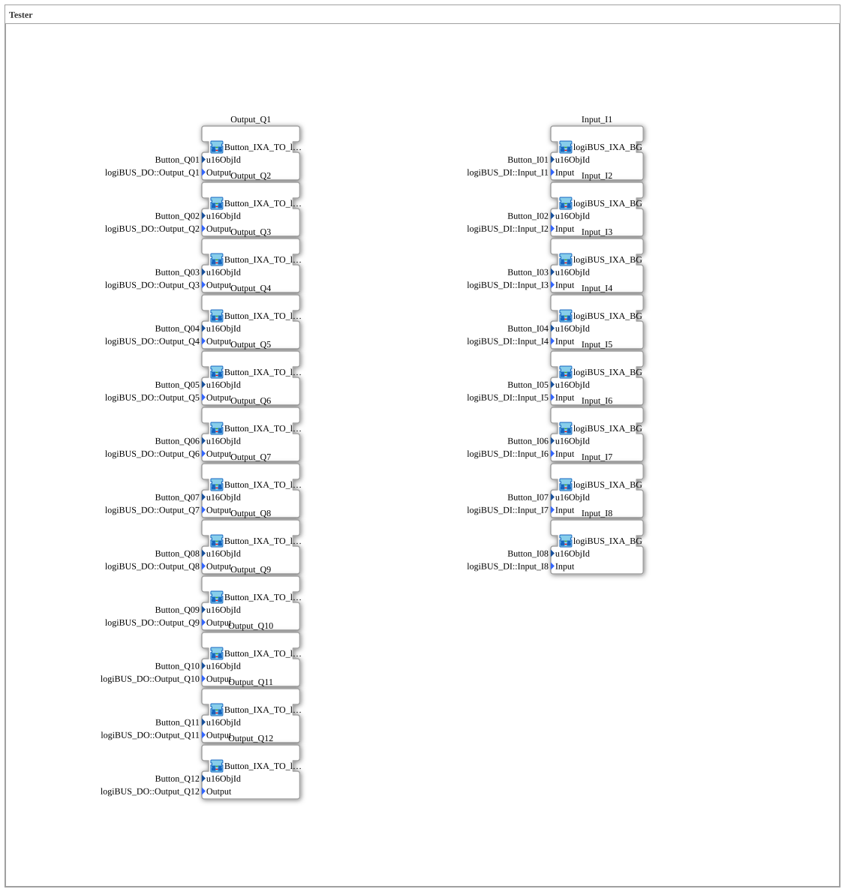

# InputOutputTesterBt: DIDO Tester (VT, ohne OPC-UA)

* * * * * * * * * *

## Einleitung

`InputOutputTesterBt` ist die ursprüngliche, rein VT-basierte Fassung des DIDO-Testers für **8 digitale Eingänge und 12 digitale Ausgänge** — historisch die erste Version dieses Trainingsbeispiels, bevor die OPC-UA-Anbindung hinzukam. Der spätere [`InputOutputTesterButton_DIDO_OPC_UA`](../Button_DIDO_OPC_UA/InputOutputTesterButton_DIDO_OPC_UA.md) übernimmt exakt dieselbe 8+12-Struktur, ersetzt aber `logiBUS_IXA_BG`/`Button_IXA_TO_logiBUS_QXA_BG` durch die `_OPC`-Varianten und ergänzt einen `SystemTickSender`.

Die Übung ist wie ihr OPC-UA-Nachfolger ein reines Top-Level-Composite ohne eigene Verbindungen — die gesamte Logik steckt in den wiederverwendbaren Sub-Bausteinen.

## Verwendete Funktionsbausteine (FBs)

| SubApp-Instanz | Typ | Zweck |
|---|---|---|
| `Input_I1` … `Input_I8` | `MyLib::sys::logiBUS_IXA_BG` | Digitaler Eingang mit VT-Statusanzeige (Grün/Weiß), **ohne** OPC-UA-Publish |
| `Output_Q1` … `Output_Q12` | `MyLib::sys::Button_IXA_TO_logiBUS_QXA_BG` | Digitaler Ausgang, schaltbar über VT-Taster, **ohne** OPC-UA-Subscribe |

### Sub-Baustein: `logiBUS_IXA_BG` (Eingänge)

- **Typ**: SubAppType (`MyLib::sys`)
- **Funktionsweise**: Liest einen physischen digitalen Eingang (`logiBUS_IXA`) und zeigt den Zustand direkt über `GreenWhiteBackground1_AX` als VT-Hintergrundfarbe (Grün/Weiß) an. Kein Adapter-Split, kein OPC-UA-Zweig — die einfachste Stufe dieser Eingangsfamilie.

### Sub-Baustein: `Button_IXA_TO_logiBUS_QXA_BG` (Ausgänge)

- **Typ**: SubAppType (`MyLib::sys`)
- **Funktionsweise**: Ein VT-Taster (`Button_IXA`) schaltet über ein `AX_SR`-Flipflop den physischen Ausgang (`logiBUS_QXA`) und dessen VT-Statusfarbe (`GreenWhiteBackground1_AX`). Nur eine Schaltquelle (VT), kein OPC-UA-Subscribe und damit auch keine der bei der OPC-UA-Variante nötigen Feedback-Loop-Entkopplung.

## Programmablauf und Verbindungen

Die Übung selbst enthält **keine Verbindungen** (`SubAppNetwork` besteht nur aus SubApp-Instanzen mit Parametern):

1. **8 Eingänge**: `Input_I1`…`Input_I8` lesen `Input_I1`…`Input_I8` und spiegeln sie per VT-Statusfarbe.
2. **12 Ausgänge**: `Output_Q1`…`Output_Q12` verbinden je einen physischen Ausgang mit VT-Taster und VT-Statusfarbe.

**Registrierung im Trainingssystem**: Wie bei allen Übungen in diesem System kein eigenes `Application`-Element nötig — Auswahl per "Change Type" im 4diac IDE auf den einen `Control`-Slot des `System`.

## Lernziele

- Grundmuster für digitale Ein-/Ausgänge rein über den VT, als Ausgangspunkt vor der OPC-UA-Erweiterung.
- Direkter Vergleich mit [`InputOutputTesterButton_DIDO_OPC_UA`](../Button_DIDO_OPC_UA/InputOutputTesterButton_DIDO_OPC_UA.md) zeigt genau, was für eine bidirektionale Web-Anbindung zusätzlich nötig ist (Adapter-Splits, `SystemTickSender`, Feedback-Loop-Entkopplung).

**Schwierigkeitsgrad**: Einsteiger
**Vorkenntnisse**: Grundlagen der logiBUS-Digital-I/O-Bausteine (`logiBUS_IXA`, `logiBUS_QXA`).

## Zusammenfassung

`InputOutputTesterBt` ist die reine VT-Basisversion des DIDO-Testers: 8 Eingänge, 12 Ausgänge, keine OPC-UA-Anbindung. Dient als didaktischer Ausgangspunkt und Vergleichsbasis für die spätere OPC-UA-Erweiterung.

---

### 🌐 Passende Themen-Unterseiten auf ms-muc-docs.de

- [🌐 Eclipse 4diac IDE & Farb-Referenz auf ms-muc-docs.de](https://www.ms-muc-docs.de/iec-61499/eclipse-4diac/)
