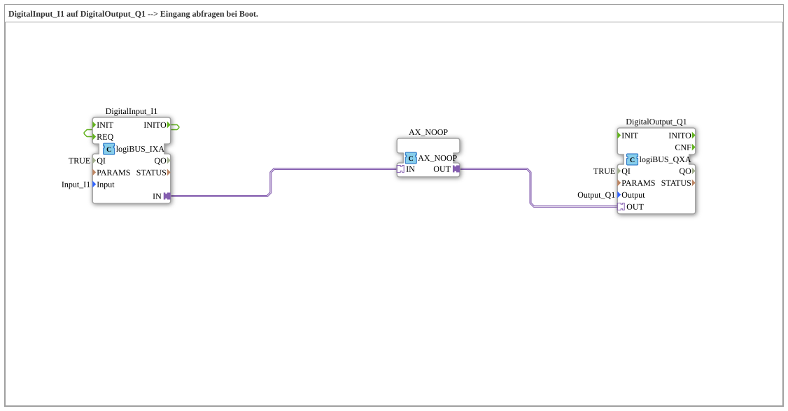

# Uebung_001c3_AX: DigitalInput_I1 auf DigitalOutput_Q1 --> Eingang abfragen bei Boot.

Dieser Artikel beschreibt die 4diac IDE Subapplikation Uebung_001c3_AX (DigitalInput_I1 auf DigitalOutput_Q1 --> Eingang abfragen bei Boot.).

----

## Ziel der Übung

Das Ziel dieser Übung ist die Umsetzung folgender Anforderung: **DigitalInput_I1 auf DigitalOutput_Q1 --> Eingang abfragen bei Boot.**

-----

## Beschreibung und Komponenten

Die Übung besteht aus der Subapplikation Uebung_001c3_AX.SUB, welche die folgende Bausteinstruktur verwendet:

### Verwendete Funktionsbausteine (FBs)

- **DigitalOutput_Q1**: Instanz des Typs logiBUS::io::DQ::logiBUS_QXA.
  - Parameter QI = TRUE
  - Parameter Output = Output_Q1
- **DigitalInput_I1**: Instanz des Typs logiBUS::io::DI::logiBUS_IXA.
  - Parameter QI = TRUE
  - Parameter Input = Input_I1
- **AX_NOOP**: Instanz des Typs adapter::booleanOperators::AX_NOOP.

### Verbindungen und Schnittstellen

**Adapterverbindungen:**
- DigitalInput_I1.IN -> AX_NOOP.IN
- AX_NOOP.OUT -> DigitalOutput_Q1.OUT

**Ereignisverbindungen:**
- DigitalInput_I1.INITO -> DigitalInput_I1.REQ

### Hinweise aus dem Modell

> ohne die Linie INITO->REQ ist der Ausgang Q1 beim Start FALSE. mit der Linie ist er TRUE.
> In Adapter-Architektur entspricht der doppelten Negierung (NOT an NOT) der Baustein AX_NOOP.

-----

## Programmablauf und Funktionsweise

1. **Initialisierung**: Beim Systemstart werden alle beteiligten Bausteine initialisiert.
2. **Ereignis- und Signalverarbeitung**: Zustandsänderungen an den Eingängen erzeugen Ereignisse, die über die definierten Verbindungen an die nachgelagerten Bausteine weitergeleitet werden.
3. **Ausgangsaktualisierung**: Die Zielbausteine verarbeiten die empfangenen Signale und aktualisieren entsprechend die Ausgänge.

-----

## Zusammenfassung

Die Übung Uebung_001c3_AX demonstriert anschaulich die modulare IEC 61499 Architektur in 4diac IDE.
