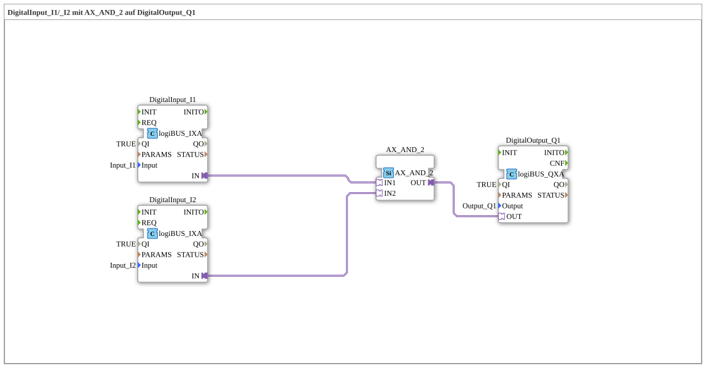

# Uebung_002a4_AX: DigitalInput_I1/_I2 mit AX_AND_2 auf DigitalOutput_Q1

Dieser Artikel beschreibt die 4diac IDE Subapplikation Uebung_002a4_AX (DigitalInput_I1/_I2 mit AX_AND_2 auf DigitalOutput_Q1).

----

## Ziel der Übung

Das Ziel dieser Übung ist die Umsetzung folgender Anforderung: **DigitalInput_I1/_I2 mit AX_AND_2 auf DigitalOutput_Q1**

-----

## Beschreibung und Komponenten

Die Übung besteht aus der Subapplikation Uebung_002a4_AX.SUB, welche die folgende Bausteinstruktur verwendet:

### Verwendete Funktionsbausteine (FBs)

- **DigitalOutput_Q1**: Instanz des Typs logiBUS::io::DQ::logiBUS_QXA.
  - Parameter QI = TRUE
  - Parameter Output = Output_Q1
- **DigitalInput_I1**: Instanz des Typs logiBUS::io::DI::logiBUS_IXA.
  - Parameter QI = TRUE
  - Parameter Input = Input_I1
- **DigitalInput_I2**: Instanz des Typs logiBUS::io::DI::logiBUS_IXA.
  - Parameter QI = TRUE
  - Parameter Input = Input_I2
- **AX_AND_2**: Instanz des Typs adapter::booleanOperators::AX_AND_2.

### Verbindungen und Schnittstellen

**Adapterverbindungen:**

- DigitalInput_I1.IN -> AX_AND_2.IN1
- DigitalInput_I2.IN -> AX_AND_2.IN2
- AX_AND_2.OUT -> DigitalOutput_Q1.OUT

-----

## Programmablauf und Funktionsweise

1. **Initialisierung**: Beim Systemstart werden alle beteiligten Bausteine initialisiert.
2. **Ereignis- und Signalverarbeitung**: Zustandsänderungen an den Eingängen erzeugen Ereignisse, die über die definierten Verbindungen an die nachgelagerten Bausteine weitergeleitet werden.
3. **Ausgangsaktualisierung**: Die Zielbausteine verarbeiten die empfangenen Signale und aktualisieren entsprechend die Ausgänge.

-----

## Zusammenfassung

Die Übung Uebung_002a4_AX demonstriert anschaulich die modulare IEC 61499 Architektur in 4diac IDE.
