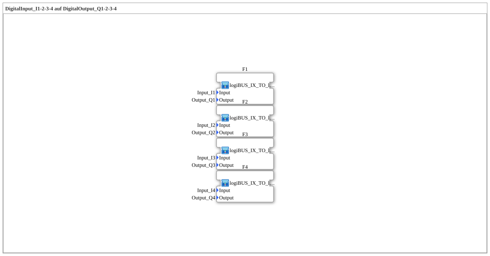

# Uebung_003b_AX: DigitalInput_I1-2-3-4 auf DigitalOutput_Q1-2-3-4

Dieser Artikel beschreibt die 4diac IDE Subapplikation Uebung_003b_AX (DigitalInput_I1-2-3-4 auf DigitalOutput_Q1-2-3-4).

----

## Ziel der Übung

Das Ziel dieser Übung ist die Umsetzung folgender Anforderung: **DigitalInput_I1-2-3-4 auf DigitalOutput_Q1-2-3-4**

-----

## Beschreibung und Komponenten

Die Übung besteht aus der Subapplikation Uebung_003b_AX.SUB, welche die folgende Bausteinstruktur verwendet:

-----

## Programmablauf und Funktionsweise

1. **Initialisierung**: Beim Systemstart werden alle beteiligten Bausteine initialisiert.
2. **Signalweiterleitung**: Die Bausteine verarbeiten Daten- und Steuersignale gemäß ihrer Konfiguration.

-----

## Zusammenfassung

Die Übung Uebung_003b_AX demonstriert anschaulich die modulare IEC 61499 Architektur in 4diac IDE.
