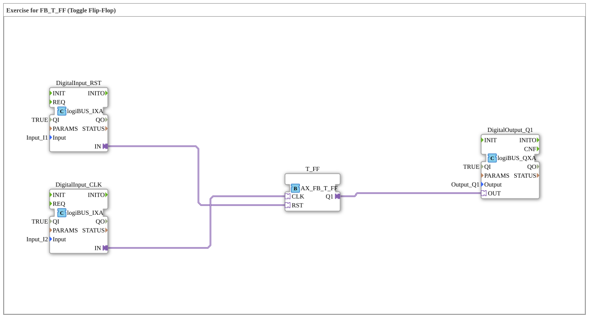

# Uebung_004d_T_AX: Exercise for FB_T_FF (Toggle Flip-Flop)

Dieser Artikel beschreibt die 4diac IDE Subapplikation Uebung_004d_T_AX (Exercise for FB_T_FF (Toggle Flip-Flop)).

----

## Ziel der Übung

Das Ziel dieser Übung ist die Umsetzung folgender Anforderung: **Exercise for FB_T_FF (Toggle Flip-Flop)**

-----

## Beschreibung und Komponenten

Die Übung besteht aus der Subapplikation Uebung_004d_T_AX.SUB, welche die folgende Bausteinstruktur verwendet:

### Verwendete Funktionsbausteine (FBs)

- **DigitalInput_RST**: Instanz des Typs logiBUS::io::DI::logiBUS_IXA.
  - Parameter QI = TRUE
  - Parameter Input = Input_I1
- **DigitalInput_CLK**: Instanz des Typs logiBUS::io::DI::logiBUS_IXA.
  - Parameter QI = TRUE
  - Parameter Input = Input_I2
- **T_FF**: Instanz des Typs adapter::bistableElements::AX_FB_T_FF.
- **DigitalOutput_Q1**: Instanz des Typs logiBUS::io::DQ::logiBUS_QXA.
  - Parameter QI = TRUE
  - Parameter Output = Output_Q1

### Verbindungen und Schnittstellen

**Adapterverbindungen:**

- DigitalInput_RST.IN -> T_FF.RST
- DigitalInput_CLK.IN -> T_FF.CLK
- T_FF.Q1 -> DigitalOutput_Q1.OUT

-----

## Programmablauf und Funktionsweise

1. **Initialisierung**: Beim Systemstart werden alle beteiligten Bausteine initialisiert.
2. **Ereignis- und Signalverarbeitung**: Zustandsänderungen an den Eingängen erzeugen Ereignisse, die über die definierten Verbindungen an die nachgelagerten Bausteine weitergeleitet werden.
3. **Ausgangsaktualisierung**: Die Zielbausteine verarbeiten die empfangenen Signale und aktualisieren entsprechend die Ausgänge.

-----

## Zusammenfassung

Die Übung Uebung_004d_T_AX demonstriert anschaulich die modulare IEC 61499 Architektur in 4diac IDE.
