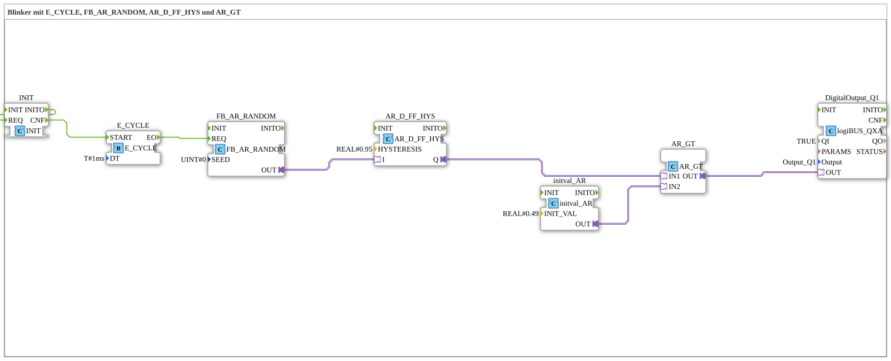

# Uebung_007d3_AX: Blinker mit E_CYCLE, FB_AR_RANDOM, AR_D_FF_HYS und AR_GT

Dieser Artikel beschreibt die 4diac IDE Subapplikation Uebung_007d3_AX (Blinker mit E_CYCLE, FB_AR_RANDOM, AR_D_FF_HYS und AR_GT).

----

## Ziel der Übung

Das Ziel dieser Übung ist die Umsetzung folgender Anforderung: **Blinker mit E_CYCLE, FB_AR_RANDOM, AR_D_FF_HYS und AR_GT**

-----

## Beschreibung und Komponenten

Die Übung besteht aus der Subapplikation Uebung_007d3_AX.SUB, welche die folgende Bausteinstruktur verwendet:

### Verwendete Funktionsbausteine (FBs)

- **DigitalOutput_Q1**: Instanz des Typs logiBUS::io::DQ::logiBUS_QXA.
  - Parameter QI = TRUE
  - Parameter Output = Output_Q1
- **E_CYCLE**: Instanz des Typs iec61499::events::E_CYCLE.
  - Parameter DT = T#1ms
- **FB_AR_RANDOM**: Instanz des Typs adapter::utils::FB_AR_RANDOM.
  - Parameter SEED = 0
- **AR_D_FF_HYS**: Instanz des Typs adapter::events::unidirectional::AR_D_FF_HYS.
  - Parameter HYSTERESIS = REAL#0.95
- **initval_AR**: Instanz des Typs adapter::types::unidirectional::AR::initval::initval_AR.
  - Parameter INIT_VAL = REAL#0.49
- **AR_GT**: Instanz des Typs adapter::iec61131::comparison::AR_GT.
- **INIT**: Instanz des Typs iec61131::booleanOperators::INIT.

### Verbindungen und Schnittstellen

**Adapterverbindungen:**
- FB_AR_RANDOM.OUT -> AR_D_FF_HYS.I
- AR_D_FF_HYS.Q -> AR_GT.IN1
- initval_AR.OUT -> AR_GT.IN2
- AR_GT.OUT -> DigitalOutput_Q1.OUT

**Ereignisverbindungen:**
- INIT.INITO -> INIT.REQ
- INIT.CNF -> E_CYCLE.START
- E_CYCLE.EO -> FB_AR_RANDOM.REQ

-----

## Programmablauf und Funktionsweise

1. **Initialisierung**: Beim Systemstart werden alle beteiligten Bausteine initialisiert.
2. **Ereignis- und Signalverarbeitung**: Zustandsänderungen an den Eingängen erzeugen Ereignisse, die über die definierten Verbindungen an die nachgelagerten Bausteine weitergeleitet werden.
3. **Ausgangsaktualisierung**: Die Zielbausteine verarbeiten die empfangenen Signale und aktualisieren entsprechend die Ausgänge.

-----

## Zusammenfassung

Die Übung Uebung_007d3_AX demonstriert anschaulich die modulare IEC 61499 Architektur in 4diac IDE.
