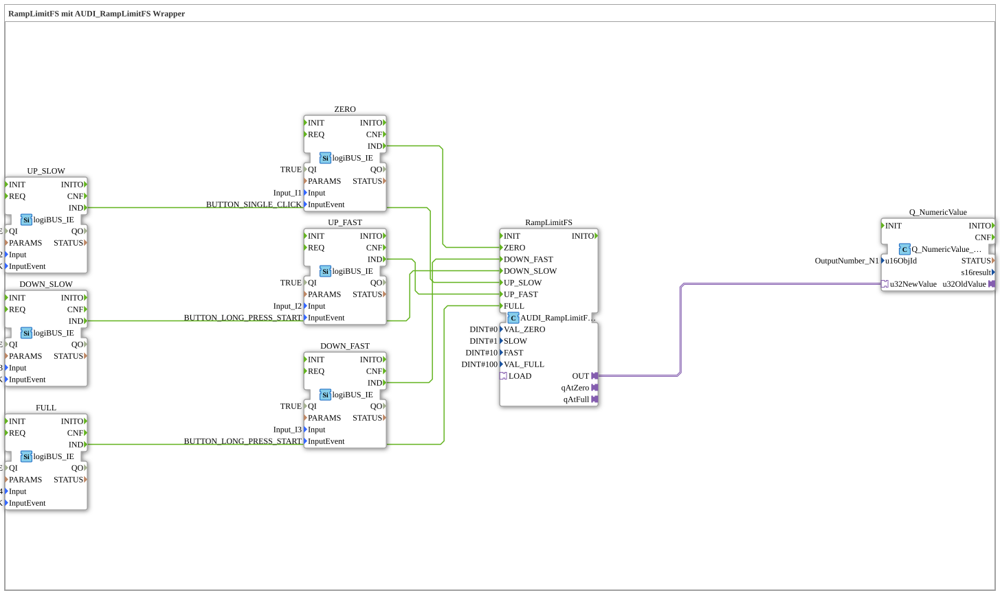

# Uebung_009a_AX: RampLimitFS mit AUDI_RampLimitFS Wrapper

Dieser Artikel beschreibt die 4diac IDE Subapplikation Uebung_009a_AX (RampLimitFS mit AUDI_RampLimitFS Wrapper).

----

## Ziel der Übung

Das Ziel dieser Übung ist die Umsetzung folgender Anforderung: **RampLimitFS mit AUDI_RampLimitFS Wrapper**

-----

## Beschreibung und Komponenten

Die Übung besteht aus der Subapplikation Uebung_009a_AX.SUB, welche die folgende Bausteinstruktur verwendet:

### Verwendete Funktionsbausteine (FBs)

- **Q_NumericValue**: Instanz des Typs isobus::UT::Q::Q_NumericValue_AUDI.
  - Parameter u16ObjId = OutputNumber_N1
- **UP_FAST**: Instanz des Typs logiBUS::io::DI::logiBUS_IE.
  - Parameter QI = TRUE
  - Parameter PARAMS = 
  - Parameter Input = Input_I2
  - Parameter InputEvent = BUTTON_LONG_PRESS_START
- **DOWN_SLOW**: Instanz des Typs logiBUS::io::DI::logiBUS_IE.
  - Parameter QI = TRUE
  - Parameter PARAMS = 
  - Parameter Input = Input_I3
  - Parameter InputEvent = BUTTON_SINGLE_CLICK
- **ZERO**: Instanz des Typs logiBUS::io::DI::logiBUS_IE.
  - Parameter QI = TRUE
  - Parameter PARAMS = 
  - Parameter Input = Input_I1
  - Parameter InputEvent = BUTTON_SINGLE_CLICK
- **DOWN_FAST**: Instanz des Typs logiBUS::io::DI::logiBUS_IE.
  - Parameter QI = TRUE
  - Parameter PARAMS = 
  - Parameter Input = Input_I3
  - Parameter InputEvent = BUTTON_LONG_PRESS_START
- **UP_SLOW**: Instanz des Typs logiBUS::io::DI::logiBUS_IE.
  - Parameter QI = TRUE
  - Parameter PARAMS = 
  - Parameter Input = Input_I2
  - Parameter InputEvent = BUTTON_SINGLE_CLICK
- **RampLimitFS**: Instanz des Typs adapter::signalprocessing::ramp::AUDI_RampLimitFS.
  - Parameter VAL_ZERO = DINT#0
  - Parameter SLOW = DINT#1
  - Parameter FAST = DINT#10
  - Parameter VAL_FULL = DINT#100
- **FULL**: Instanz des Typs logiBUS::io::DI::logiBUS_IE.
  - Parameter QI = TRUE
  - Parameter PARAMS = 
  - Parameter Input = Input_I4
  - Parameter InputEvent = BUTTON_SINGLE_CLICK

### Verbindungen und Schnittstellen

**Adapterverbindungen:**
- RampLimitFS.OUT -> Q_NumericValue.u32NewValue

**Ereignisverbindungen:**
- UP_FAST.IND -> RampLimitFS.UP_FAST
- FULL.IND -> RampLimitFS.FULL
- ZERO.IND -> RampLimitFS.ZERO
- DOWN_SLOW.IND -> RampLimitFS.DOWN_SLOW
- DOWN_FAST.IND -> RampLimitFS.DOWN_FAST
- UP_SLOW.IND -> RampLimitFS.UP_SLOW

-----

## Programmablauf und Funktionsweise

1. **Initialisierung**: Beim Systemstart werden alle beteiligten Bausteine initialisiert.
2. **Ereignis- und Signalverarbeitung**: Zustandsänderungen an den Eingängen erzeugen Ereignisse, die über die definierten Verbindungen an die nachgelagerten Bausteine weitergeleitet werden.
3. **Ausgangsaktualisierung**: Die Zielbausteine verarbeiten die empfangenen Signale und aktualisieren entsprechend die Ausgänge.

-----

## Zusammenfassung

Die Übung Uebung_009a_AX demonstriert anschaulich die modulare IEC 61499 Architektur in 4diac IDE.
