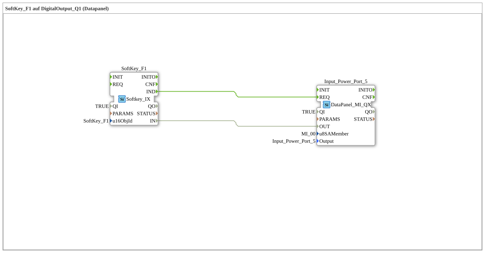

# Uebung_010a5_AX: SoftKey_F1 auf DigitalOutput_Q1 (Datapanel)

Dieser Artikel beschreibt die 4diac IDE Subapplikation Uebung_010a5_AX (SoftKey_F1 auf DigitalOutput_Q1 (Datapanel)).

----

## Ziel der Übung

Das Ziel dieser Übung ist die Umsetzung folgender Anforderung: **SoftKey_F1 auf DigitalOutput_Q1 (Datapanel)**

-----

## Beschreibung und Komponenten

Die Übung besteht aus der Subapplikation Uebung_010a5_AX.SUB, welche die folgende Bausteinstruktur verwendet:

### Verwendete Funktionsbausteine (FBs)

- **Input_Power_Port_5**: Instanz des Typs DataPanel::io::MI::DQ::DataPanel_MI_QX.
  - Parameter QI = TRUE
  - Parameter u8SAMember = MI_00
  - Parameter Output = Input_Power_Port_5
- **SoftKey_F1**: Instanz des Typs isobus::UT::io::Softkey::Softkey_IX.
  - Parameter QI = TRUE
  - Parameter u16ObjId = SoftKey_F1

### Verbindungen und Schnittstellen

**Ereignisverbindungen:**

- SoftKey_F1.IND -> Input_Power_Port_5.REQ

**Datenverbindungen:**

- SoftKey_F1.IN -> Input_Power_Port_5.OUT

-----

## Programmablauf und Funktionsweise

1. **Initialisierung**: Beim Systemstart werden alle beteiligten Bausteine initialisiert.
2. **Ereignis- und Signalverarbeitung**: Zustandsänderungen an den Eingängen erzeugen Ereignisse, die über die definierten Verbindungen an die nachgelagerten Bausteine weitergeleitet werden.
3. **Ausgangsaktualisierung**: Die Zielbausteine verarbeiten die empfangenen Signale und aktualisieren entsprechend die Ausgänge.

-----

## Zusammenfassung

Die Übung Uebung_010a5_AX demonstriert anschaulich die modulare IEC 61499 Architektur in 4diac IDE.
