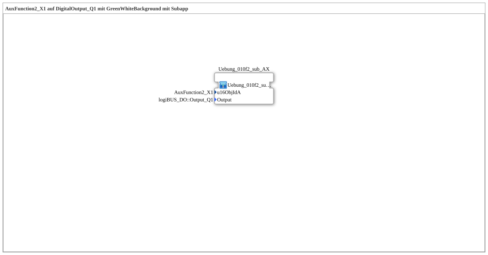

# Uebung_010f2_AX: AuxFunction2_X1 auf DigitalOutput_Q1 mit GreenWhiteBackground mit Subapp

* * * * * * * * * *

## Einleitung

Diese Übung löst den in `Uebung_010f_AX` genannten Nachteil auf, dass die Objekt-ID `AuxFunction2_X1` an zwei Stellen (Aux-FB und `GreenWhiteBackground2_AX`) einzeln eingetragen werden muss – genau wie `Uebung_010c2_AX` es für `Uebung_010c_AX` tut. Die gesamte Netzwerkstruktur besteht auf oberster Ebene nur noch aus einer einzigen Subapp-Instanz.

## Verwendete Funktionsbausteine (FBs)

Auf oberster Ebene der SubApp befindet sich kein einzelner FB, sondern ausschließlich die unten beschriebene Sub-Applikation.

### Sub-Bausteine: Uebung_010f2_sub_AX

- **Uebung_010f2_sub_AX** (Typ: `Uebungen::Uebung_010f2_sub_AX`)
    - **Parameter**: `u16ObjIdA = AuxFunction2_X1` (Objekt-ID des Aux-Objekts), `Output = logiBUS_DO::Output_Q1` (Identität des physischen Ausgangs)
    - **Erklärung**: Kapselt die komplette Logik aus `Uebung_010f_AX` in einer wiederverwendbaren Subapp mit genau zwei Eingängen: `u16ObjIdA` und `Output`. Intern enthält sie dieselben vier Bausteine wie `Uebung_010f_AX` – `AuxFunction2_X1` (`Aux_IXA`), `AX_SPLIT_2`, `DigitalOutput_Q1` (`logiBUS_QXA`) und `GreenWhiteBackground2_AX` – mit identischer Verdrahtung (`AuxFunction2_X1.IN → AX_SPLIT_2.IN → OUT1 → DigitalOutput_Q1.OUT` und `OUT2 → GreenWhiteBackground2_AX.DI1`). Der einzige Unterschied: Eine interne (unsichtbare) `DataConnection` verteilt den Subapp-Eingang `u16ObjIdA` gleichzeitig an `AuxFunction2_X1.u16ObjId` und an `GreenWhiteBackground2_AX.u16ObjIdA`, und eine weitere an `DigitalOutput_Q1.Output` – die Objekt-ID muss beim Aufruf der Subapp dadurch nur noch einmal angegeben werden.

## Programmablauf und Verbindungen

1. Beim Instanziieren der SubApp wird `Uebung_010f2_sub_AX` mit den beiden Parametern `u16ObjIdA` (Objekt-ID des Aux-Objekts) und `Output` (Ziel-Ausgang) versehen.
2. Innerhalb der Sub-Applikation verteilt eine DataConnection `u16ObjIdA` intern an `AuxFunction2_X1.u16ObjId` und an `GreenWhiteBackground2_AX.u16ObjIdA`; eine weitere DataConnection verteilt `Output` an `DigitalOutput_Q1.Output`.
3. Der eigentliche Signalfluss ist danach identisch zu `Uebung_010f_AX`: `AuxFunction2_X1.IN → AX_SPLIT_2.IN`, `AX_SPLIT_2.OUT1 → DigitalOutput_Q1.OUT` (physischer Ausgang folgt dem Aux-Zustand) und `AX_SPLIT_2.OUT2 → GreenWhiteBackground2_AX.DI1` (Hintergrundfarbe auf VT-Bildschirm und Aux-Handle).

## Zusammenfassung

`Uebung_010f2_AX` demonstriert, wie sich eine mehrfach benötigte Objekt-ID durch Kapselung in eine eigene Subapp auf einen einzigen Eintragspunkt reduzieren lässt. Funktional ist die Übung identisch zu `Uebung_010f_AX`; der Unterschied liegt ausschließlich in der Wiederverwendbarkeit und Wartbarkeit der Verdrahtung.

---

### 🌐 Passende Themen-Unterseiten auf ms-muc-docs.de

- [🌐 Eclipse 4diac IDE & Farb-Referenz auf ms-muc-docs.de](https://www.ms-muc-docs.de/iec-61499/eclipse-4diac/)
