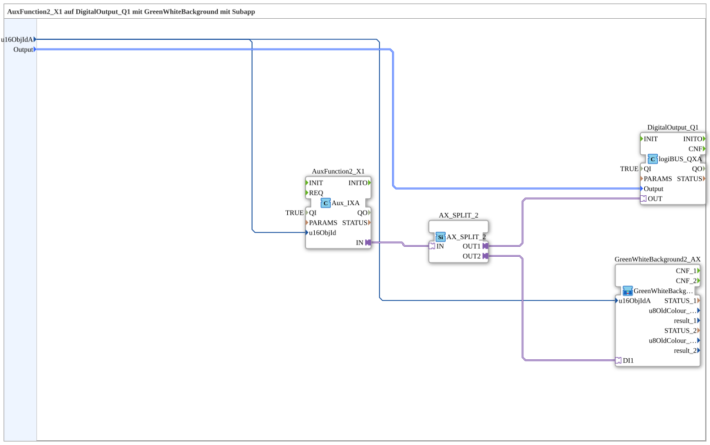

# Uebung_010f2_sub_AX: Sub-Baustein für AuxFunction2_X1 mit GreenWhiteBackground (Objekt-ID nur einmal)

* * * * * * * * * *

## Einleitung

Dieser SubApp-Typ kapselt die komplette Verdrahtung aus `Uebung_010f_AX` (Aux-Taster → Ausgang + Hintergrundfarbe) in einem wiederverwendbaren Sub-Baustein. Nach außen werden nur noch die zwei tatsächlich benötigten Parameter `u16ObjIdA` und `Output` angeboten – die Objekt-ID muss dadurch nur noch einmal angegeben werden, nicht mehr getrennt für den Aux-Eingang und den Hintergrundfarben-Baustein.

## Verwendete Funktionsbausteine (FBs)

- **AuxFunction2_X1**: Auxiliary-Eingang (Typ: `isobus::UT::io::Auxiliary::IN::Aux_IXA`)
    - **Parameter**: `QI = TRUE` (`u16ObjId` kommt von außen über die Schnittstelle)
    - **Erklärung**: Liefert den booleschen Zustand des über `u16ObjIdA` zugewiesenen Aux-Tasters/Joysticks als AX-Adaptersignal (`IN`).
- **AX_SPLIT_2**: Signal-Verteiler (Typ: `adapter::events::unidirectional::AX_SPLIT_2`)
    - **Parameter**: keine
    - **Erklärung**: Verteilt das eine eingehende AX-Signal auf zwei Ausgänge (`OUT1`, `OUT2`).
- **DigitalOutput_Q1**: logiBUS Digitalausgang (Typ: `logiBUS::io::DQ::logiBUS_QXA`)
    - **Parameter**: `QI = TRUE` (`Output` kommt von außen über die Schnittstelle)
    - **Erklärung**: Physischer Ausgang, der direkt vom Aux-Signal (`AX_SPLIT_2.OUT1`) geschaltet wird.

### Sub-Bausteine: GreenWhiteBackground2_AX

- **GreenWhiteBackground2_AX**: Hintergrundfarben-Baustein für Auxiliary-Function-Type-2-Objekte (Typ: `MyLib::sys::GreenWhiteBackground2_AX`)
    - **Parameter**: `u16ObjIdA` kommt von außen über die Schnittstelle
    - **Erklärung**: Setzt bei einem Signal an `DI1` die Hintergrundfarbe grün, sonst weiß – gleichzeitig am VT-Bildschirm (`Q_BackgroundColour`) und am Aux-Handle selbst (`Q_BackgroundColourAux`), wie bereits in `Uebung_010f_AX` beschrieben. Diese Verdrahtung bleibt gegenüber `Uebung_010f_AX` unverändert; es ist keine Vereinfachung nötig, sondern Absicht.

## Schnittstelle (SubApp-Interface)

- **u16ObjIdA** (`UINT`, Default `ID_NULL`): einzige von außen anzugebende Objekt-ID des Aux-Bedienelements.
- **Output** (`logiBUS::io::DQ::logiBUS_DO_S`, Default `logiBUS_DO::Invalid`): einzige von außen anzugebende Zuweisung des physischen Digitalausgangs.

## Programmablauf und Verbindungen

1. **Verteilung der Objekt-ID**: Eine `DataConnection` fächert den einzigen Eingang `u16ObjIdA` intern auf zwei Ziele auf: `AuxFunction2_X1.u16ObjId` und `GreenWhiteBackground2_AX.u16ObjIdA`. Der Anwender dieses Sub-Bausteins muss die Objekt-ID dadurch nur noch einmal beim Aufruf angeben.
2. **Verteilung des Ausgangs**: Ebenso wird der Eingang `Output` per `DataConnection` an `DigitalOutput_Q1.Output` weitergereicht.
3. **Signalerfassung**: `AuxFunction2_X1` liefert bei Betätigung des zugewiesenen Aux-Tasters/Joysticks ein AX-Signal an `IN`.
4. **Verteilung des AX-Signals**: `AuxFunction2_X1.IN → AX_SPLIT_2.IN` führt das Signal in den Verteiler, der es unverändert auf `OUT1` und `OUT2` dupliziert.
5. **Physischer Ausgang**: `AX_SPLIT_2.OUT1 → DigitalOutput_Q1.OUT` schaltet den zugewiesenen physischen Ausgang synchron zum Aux-Taster.
6. **Visuelles Feedback**: `AX_SPLIT_2.OUT2 → GreenWhiteBackground2_AX.DI1` setzt gleichzeitig die Hintergrundfarbe an VT-Bildschirm und Aux-Handle.

## Zusammenfassung

`Uebung_010f2_sub_AX` ist der wiederverwendbare Sub-Baustein hinter `Uebung_010f2_AX`: er übernimmt intern exakt dieselbe Verdrahtung wie `Uebung_010f_AX` (Aux-Eingang → `AX_SPLIT_2` → physischer Ausgang + `GreenWhiteBackground2_AX`), reduziert die nach außen sichtbare Schnittstelle jedoch auf zwei Parameter (`u16ObjIdA`, `Output`) und verteilt die Objekt-ID intern per Datenverbindung an beide Stellen, die sie benötigen. Damit muss die Objekt-ID beim Einsatz dieses Bausteins nur noch einmal angegeben werden.

---

### 🌐 Passende Themen-Unterseiten auf ms-muc-docs.de

- [🌐 Eclipse 4diac IDE & Farb-Referenz auf ms-muc-docs.de](https://www.ms-muc-docs.de/iec-61499/eclipse-4diac/)
