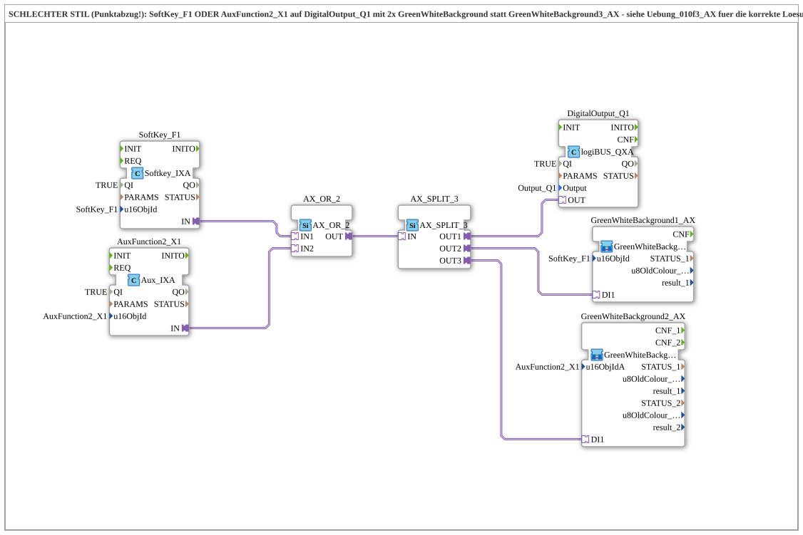

# Uebung_010f4_AX: SCHLECHTER STIL (Punktabzug!) — SoftKey_F1 ODER AuxFunction2_X1 auf DigitalOutput_Q1 mit 2x GreenWhiteBackground

* * * * * * * * * *

## Einleitung

**Diese Datei ist absichtlich als Negativbeispiel stehen gelassen** (im Quellcode ausdrücklich als „SCHLECHTER STIL – Punktabzug!“ gekennzeichnet). Sie erreicht funktional dasselbe wie `Uebung_010f3_AX` (SoftKey ODER Aux-Taster schalten gemeinsam `Q1`), tut dies aber mit unnötig aufgeblähter Verdrahtung: statt des dafür vorgesehenen Bausteins `GreenWhiteBackground3_AX` werden zwei separate Instanzen `GreenWhiteBackground1_AX` und `GreenWhiteBackground2_AX` verwendet. Diese Seite dokumentiert bewusst den Fehler, nicht eine empfohlene Lösung – für die korrekte Umsetzung siehe `Uebung_010f3_AX`.

## Verwendete Funktionsbausteine (FBs)

- **SoftKey_F1**: VT-SoftKey-Eingang (Typ: `isobus::UT::io::Softkey::Softkey_IXA`)
    - **Parameter**: `QI = TRUE`, `u16ObjId = SoftKey_F1`
    - **Erklärung**: Liefert den booleschen Zustand des SoftKeys als AX-Adapterausgang `IN`.
- **AuxFunction2_X1**: Auxiliary-Eingang (Typ: `isobus::UT::io::Auxiliary::IN::Aux_IXA`)
    - **Parameter**: `QI = TRUE`, `u16ObjId = AuxFunction2_X1`
    - **Erklärung**: Liefert den booleschen Zustand des zugewiesenen physischen Aux-Tasters/Joysticks als AX-Adapterausgang `IN`.
- **AX_OR_2**: Adapter-ODER-Verknüpfung (Typ: `adapter::booleanOperators::AX_OR_2`)
    - **Parameter**: keine
    - **Erklärung**: Verknüpft die beiden AX-Signale von SoftKey und Aux-Taster per ODER zu einem gemeinsamen Signal.
- **AX_SPLIT_3**: Adapter-Signalverteiler auf drei Ziele (Typ: `adapter::events::unidirectional::AX_SPLIT_3`)
    - **Parameter**: keine
    - **Erklärung**: Verteilt das ODER-verknüpfte Signal auf **drei** statt zwei Ziele, weil hier zwei getrennte Hintergrundfarben-Bausteine statt eines kombinierten bedient werden müssen – der eigentliche Konstruktionsfehler dieser Übung.
- **DigitalOutput_Q1**: logiBUS Digitalausgang (Typ: `logiBUS::io::DQ::logiBUS_QXA`)
    - **Parameter**: `QI = TRUE`, `Output = Output_Q1`
    - **Erklärung**: Schaltet den physischen Ausgang `Q1`, sobald SoftKey oder Aux-Taster aktiv sind.

### Sub-Bausteine: GreenWhiteBackground1_AX, GreenWhiteBackground2_AX

- **GreenWhiteBackground1_AX** (Typ: `MyLib::sys::GreenWhiteBackground1_AX`)
    - **Parameter**: `u16ObjId = SoftKey_F1`
    - **Erklärung**: Setzt die Hintergrundfarbe des SoftKey-Objekts auf dem VT-Bildschirm. Wird hier als **separate** Instanz benötigt, weil kein kombinierter Baustein verwendet wurde.
- **GreenWhiteBackground2_AX** (Typ: `MyLib::sys::GreenWhiteBackground2_AX`)
    - **Parameter**: `u16ObjIdA = AuxFunction2_X1`
    - **Erklärung**: Setzt die Hintergrundfarbe des Aux-Objekts auf VT-Bildschirm und Aux-Handle. Ebenfalls als **separate** Instanz statt in `GreenWhiteBackground3_AX` zusammengefasst.

## Programmablauf und Verbindungen

1. `SoftKey_F1.IN` → `AX_OR_2.IN1` und `AuxFunction2_X1.IN` → `AX_OR_2.IN2`: beide Bedienelemente liefern je ein AX-Signal an die ODER-Verknüpfung.
2. `AX_OR_2.OUT` → `AX_SPLIT_3.IN`: das kombinierte Signal wird auf **drei** statt zwei Verbraucher verteilt.
3. `AX_SPLIT_3.OUT1` → `DigitalOutput_Q1.OUT`: der physische Ausgang `Q1` schaltet EIN, sobald SoftKey ODER Aux-Taster aktiv ist.
4. `AX_SPLIT_3.OUT2` → `GreenWhiteBackground1_AX.DI1`: separate Ansteuerung der SoftKey-Hintergrundfarbe.
5. `AX_SPLIT_3.OUT3` → `GreenWhiteBackground2_AX.DI1`: separate Ansteuerung der Aux-Hintergrundfarbe.

**Was hier falsch gemacht wurde:** Durch die Verwendung von zwei einzelnen `GreenWhiteBackground1_AX`/`GreenWhiteBackground2_AX`-Instanzen statt des dafür gebauten kombinierten Bausteins `GreenWhiteBackground3_AX` war ein `AX_SPLIT_3` (3 Ziele) statt eines simplen `AX_SPLIT_2` (2 Ziele) nötig. Die Farbauswahl-Logik (intern `AX_SEL` Weiß/Grün) läuft dadurch doppelt statt einmal – unnötiger Ressourcenverbrauch und unnötig große Diagramme, ohne jeden funktionalen Vorteil gegenüber `Uebung_010f3_AX`.

## Zusammenfassung

Diese Übung ist bewusst kein Vorbild, sondern eine Lehrbeispiel-Warnung: Bevor man für einen kombinierten Fall (normales VT-Objekt + Aux-Objekt) mehrere generische Bausteine einzeln zusammenschraubt, sollte man erst prüfen, ob es dafür nicht schon einen passenden, fertigen Baustein in der Bibliothek gibt (hier: `GreenWhiteBackground3_AX`, siehe `Uebung_010f3_AX`). Der Vergleich beider SubApps im 4diac-Editor macht den Unterschied im Ressourcenverbrauch unmittelbar sichtbar.

---

### 🌐 Passende Themen-Unterseiten auf ms-muc-docs.de

- [🌐 Eclipse 4diac IDE & Farb-Referenz auf ms-muc-docs.de](https://www.ms-muc-docs.de/iec-61499/eclipse-4diac/)
