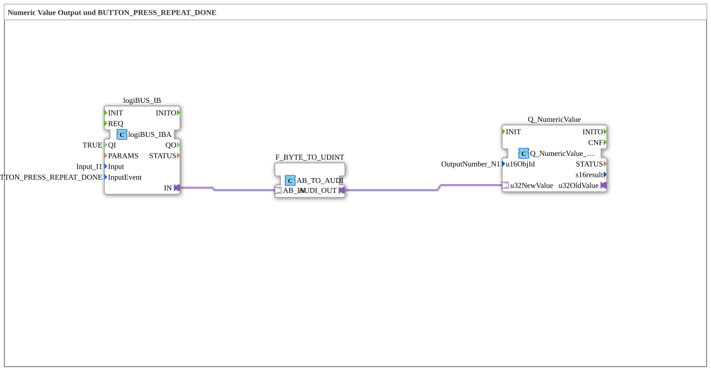

# Uebung_011a_AX: Numeric Value Output und BUTTON_PRESS_REPEAT_DONE

Dieser Artikel beschreibt die 4diac IDE Subapplikation Uebung_011a_AX (Numeric Value Output und BUTTON_PRESS_REPEAT_DONE).

----

## Ziel der Übung

Das Ziel dieser Übung ist die Umsetzung folgender Anforderung: **Numeric Value Output und BUTTON_PRESS_REPEAT_DONE**

-----

## Beschreibung und Komponenten

Die Übung besteht aus der Subapplikation Uebung_011a_AX.SUB, welche die folgende Bausteinstruktur verwendet:

### Verwendete Funktionsbausteine (FBs)

- **Q_NumericValue**: Instanz des Typs isobus::UT::Q::Q_NumericValue_AUDI.
  - Parameter u16ObjId = OutputNumber_N1
- **logiBUS_IB**: Instanz des Typs logiBUS::io::DI::logiBUS_IBA.
  - Parameter QI = TRUE
  - Parameter Input = Input_I1
  - Parameter InputEvent = BUTTON_PRESS_REPEAT_DONE
- **F_BYTE_TO_UDINT**: Instanz des Typs adapter::conversion::unidirectional::AB_TO_AUDI.

### Verbindungen und Schnittstellen

**Adapterverbindungen:**

- logiBUS_IB.IN -> F_BYTE_TO_UDINT.AB_IN
- F_BYTE_TO_UDINT.AUDI_OUT -> Q_NumericValue.u32NewValue

### Hinweise aus dem Modell

> BUTTON_PRESS_REPEAT_DONE: nur am Ende 1 Event
BUTTON_PRESS_REPEAT: Während des drückens kommen Events

-----

## Programmablauf und Funktionsweise

1. **Initialisierung**: Beim Systemstart werden alle beteiligten Bausteine initialisiert.
2. **Ereignis- und Signalverarbeitung**: Zustandsänderungen an den Eingängen erzeugen Ereignisse, die über die definierten Verbindungen an die nachgelagerten Bausteine weitergeleitet werden.
3. **Ausgangsaktualisierung**: Die Zielbausteine verarbeiten die empfangenen Signale und aktualisieren entsprechend die Ausgänge.

-----

## Zusammenfassung

Die Übung Uebung_011a_AX demonstriert anschaulich die modulare IEC 61499 Architektur in 4diac IDE.
