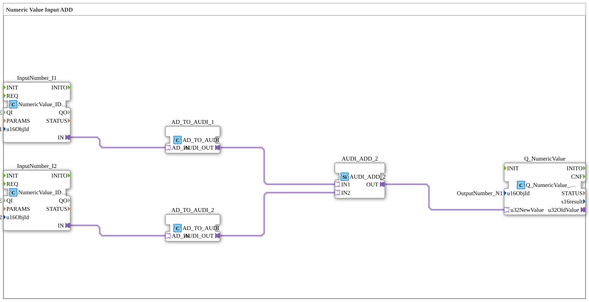

# Uebung_011b1_AX: Numeric Value Input ADD

Dieser Artikel beschreibt die 4diac IDE Subapplikation Uebung_011b1_AX (Numeric Value Input ADD).

----

## Ziel der Übung

Das Ziel dieser Übung ist die Umsetzung folgender Anforderung: **Numeric Value Input ADD**

-----

## Beschreibung und Komponenten

Die Übung besteht aus der Subapplikation Uebung_011b1_AX.SUB, welche die folgende Bausteinstruktur verwendet:

### Verwendete Funktionsbausteine (FBs)

- **InputNumber_I1**: Instanz des Typs isobus::UT::io::NumericValue::NumericValue_IDA.
  - Parameter QI = TRUE
  - Parameter u16ObjId = InputNumber_I1
- **InputNumber_I2**: Instanz des Typs isobus::UT::io::NumericValue::NumericValue_IDA.
  - Parameter QI = TRUE
  - Parameter u16ObjId = InputNumber_I2
- **AD_TO_AUDI_1**: Instanz des Typs adapter::conversion::unidirectional::AD_TO_AUDI.
- **AD_TO_AUDI_2**: Instanz des Typs adapter::conversion::unidirectional::AD_TO_AUDI.
- **AUDI_ADD_2**: Instanz des Typs adapter::iec61131::arithmetic::AUDI_ADD_2.
- **Q_NumericValue**: Instanz des Typs isobus::UT::Q::Q_NumericValue_AUDI.
  - Parameter u16ObjId = OutputNumber_N1

### Verbindungen und Schnittstellen

**Adapterverbindungen:**

- InputNumber_I1.IN -> AD_TO_AUDI_1.AD_IN
- InputNumber_I2.IN -> AD_TO_AUDI_2.AD_IN
- AD_TO_AUDI_1.AUDI_OUT -> AUDI_ADD_2.IN1
- AD_TO_AUDI_2.AUDI_OUT -> AUDI_ADD_2.IN2
- AUDI_ADD_2.OUT -> Q_NumericValue.u32NewValue

-----

## Programmablauf und Funktionsweise

1. **Initialisierung**: Beim Systemstart werden alle beteiligten Bausteine initialisiert.
2. **Ereignis- und Signalverarbeitung**: Zustandsänderungen an den Eingängen erzeugen Ereignisse, die über die definierten Verbindungen an die nachgelagerten Bausteine weitergeleitet werden.
3. **Ausgangsaktualisierung**: Die Zielbausteine verarbeiten die empfangenen Signale und aktualisieren entsprechend die Ausgänge.

-----

## Zusammenfassung

Die Übung Uebung_011b1_AX demonstriert anschaulich die modulare IEC 61499 Architektur in 4diac IDE.
