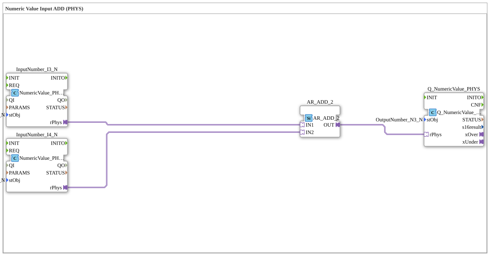

# Uebung_011b1_PHYS_AX: Numeric Value Input ADD (PHYS)

Dieser Artikel beschreibt die 4diac IDE Subapplikation Uebung_011b1_PHYS_AX (Numeric Value Input ADD (PHYS)).

----

## Ziel der Übung

Das Ziel dieser Übung ist die Umsetzung folgender Anforderung: **Numeric Value Input ADD (PHYS)**

-----

## Beschreibung und Komponenten

Die Übung besteht aus der Subapplikation Uebung_011b1_PHYS_AX.SUB, welche die folgende Bausteinstruktur verwendet:

### Verwendete Funktionsbausteine (FBs)

- **InputNumber_I3_N**: Instanz des Typs isobus::UT::io::NumericValue::NumericValue_PHYSA.
  - Parameter stObj = InputNumber_I3_N
- **InputNumber_I4_N**: Instanz des Typs isobus::UT::io::NumericValue::NumericValue_PHYSA.
  - Parameter stObj = InputNumber_I4_N
- **AR_ADD_2**: Instanz des Typs adapter::iec61131::arithmetic::AR_ADD_2.
- **Q_NumericValue_PHYS**: Instanz des Typs isobus::UT::Q::Q_NumericValue_PHYSA.
  - Parameter stObj = OutputNumber_N3_N

### Verbindungen und Schnittstellen

**Adapterverbindungen:**
- InputNumber_I3_N.rPhys -> AR_ADD_2.IN1
- InputNumber_I4_N.rPhys -> AR_ADD_2.IN2
- AR_ADD_2.OUT -> Q_NumericValue_PHYS.rPhys

-----

## Programmablauf und Funktionsweise

1. **Initialisierung**: Beim Systemstart werden alle beteiligten Bausteine initialisiert.
2. **Ereignis- und Signalverarbeitung**: Zustandsänderungen an den Eingängen erzeugen Ereignisse, die über die definierten Verbindungen an die nachgelagerten Bausteine weitergeleitet werden.
3. **Ausgangsaktualisierung**: Die Zielbausteine verarbeiten die empfangenen Signale und aktualisieren entsprechend die Ausgänge.

-----

## Zusammenfassung

Die Übung Uebung_011b1_PHYS_AX demonstriert anschaulich die modulare IEC 61499 Architektur in 4diac IDE.
