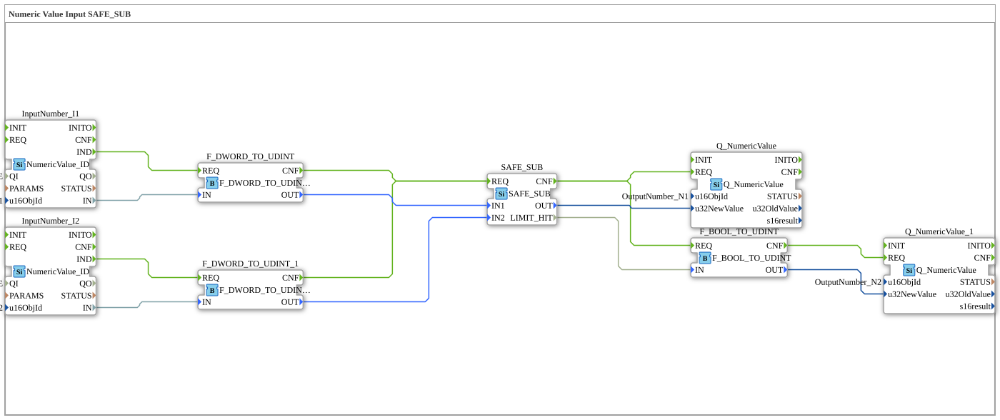

# Uebung_011b6_AX: Numeric Value Input SAFE_SUB

Dieser Artikel beschreibt die 4diac IDE Subapplikation Uebung_011b6_AX (Numeric Value Input SAFE_SUB).

----

## Ziel der Übung

Das Ziel dieser Übung ist die Umsetzung folgender Anforderung: **Numeric Value Input SAFE_SUB**

-----

## Beschreibung und Komponenten

Die Übung besteht aus der Subapplikation Uebung_011b6_AX.SUB, welche die folgende Bausteinstruktur verwendet:

### Verwendete Funktionsbausteine (FBs)

- **InputNumber_I1**: Instanz des Typs isobus::UT::io::NumericValue::NumericValue_ID.
  - Parameter QI = TRUE
  - Parameter u16ObjId = InputNumber_I1
- **InputNumber_I2**: Instanz des Typs isobus::UT::io::NumericValue::NumericValue_ID.
  - Parameter QI = TRUE
  - Parameter u16ObjId = InputNumber_I2
- **F_DWORD_TO_UDINT**: Instanz des Typs iec61131::conversion::F_DWORD_TO_UDINT.
- **F_DWORD_TO_UDINT_1**: Instanz des Typs iec61131::conversion::F_DWORD_TO_UDINT.
- **SAFE_SUB**: Instanz des Typs SafeArithmetic::arithmetic::SAFE_SUB.
- **Q_NumericValue**: Instanz des Typs isobus::UT::Q::Q_NumericValue.
  - Parameter u16ObjId = OutputNumber_N1
- **F_BOOL_TO_UDINT**: Instanz des Typs iec61131::conversion::F_BOOL_TO_UDINT.
- **Q_NumericValue_1**: Instanz des Typs isobus::UT::Q::Q_NumericValue.
  - Parameter u16ObjId = OutputNumber_N2

### Verbindungen und Schnittstellen

**Ereignisverbindungen:**

- InputNumber_I1.IND -> F_DWORD_TO_UDINT.REQ
- InputNumber_I2.IND -> F_DWORD_TO_UDINT_1.REQ
- F_DWORD_TO_UDINT.CNF -> SAFE_SUB.REQ
- F_DWORD_TO_UDINT_1.CNF -> SAFE_SUB.REQ
- SAFE_SUB.CNF -> Q_NumericValue.REQ
- SAFE_SUB.CNF -> F_BOOL_TO_UDINT.REQ
- F_BOOL_TO_UDINT.CNF -> Q_NumericValue_1.REQ

**Datenverbindungen:**

- InputNumber_I1.IN -> F_DWORD_TO_UDINT.IN
- InputNumber_I2.IN -> F_DWORD_TO_UDINT_1.IN
- F_DWORD_TO_UDINT.OUT -> SAFE_SUB.IN1
- F_DWORD_TO_UDINT_1.OUT -> SAFE_SUB.IN2
- SAFE_SUB.OUT -> Q_NumericValue.u32NewValue
- SAFE_SUB.LIMIT_HIT -> F_BOOL_TO_UDINT.IN
- F_BOOL_TO_UDINT.OUT -> Q_NumericValue_1.u32NewValue

-----

## Programmablauf und Funktionsweise

1. **Initialisierung**: Beim Systemstart werden alle beteiligten Bausteine initialisiert.
2. **Ereignis- und Signalverarbeitung**: Zustandsänderungen an den Eingängen erzeugen Ereignisse, die über die definierten Verbindungen an die nachgelagerten Bausteine weitergeleitet werden.
3. **Ausgangsaktualisierung**: Die Zielbausteine verarbeiten die empfangenen Signale und aktualisieren entsprechend die Ausgänge.

-----

## Zusammenfassung

Die Übung Uebung_011b6_AX demonstriert anschaulich die modulare IEC 61499 Architektur in 4diac IDE.
