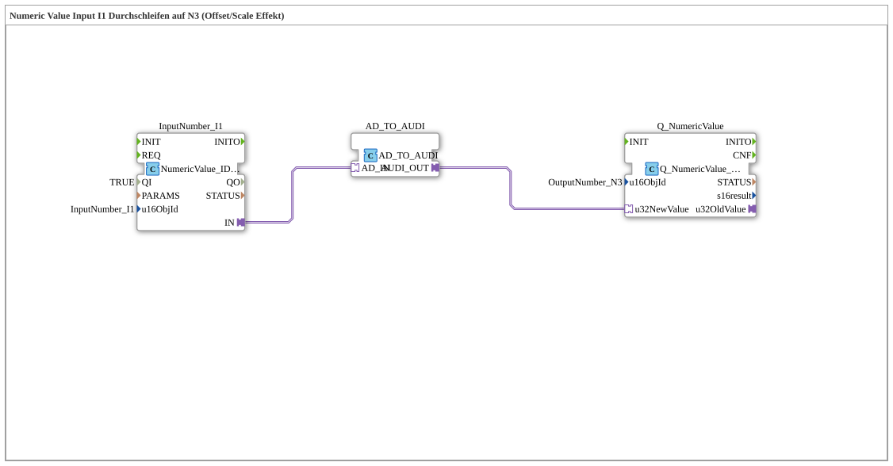

# Uebung_011d_AX: Numeric Value Input I1 Durchschleifen auf N3 (Offset/Scale Effekt)

Dieser Artikel beschreibt die 4diac IDE Subapplikation Uebung_011d_AX (Numeric Value Input I1 Durchschleifen auf N3 (Offset/Scale Effekt)).

----

## Ziel der Übung

Das Ziel dieser Übung ist die Umsetzung folgender Anforderung: **Numeric Value Input I1 Durchschleifen auf N3 (Offset/Scale Effekt)**

-----

## Beschreibung und Komponenten

Die Übung besteht aus der Subapplikation Uebung_011d_AX.SUB, welche die folgende Bausteinstruktur verwendet:

### Verwendete Funktionsbausteine (FBs)

- **InputNumber_I1**: Instanz des Typs isobus::UT::io::NumericValue::NumericValue_IDA.
  - Parameter QI = TRUE
  - Parameter u16ObjId = InputNumber_I1
- **AD_TO_AUDI**: Instanz des Typs adapter::conversion::unidirectional::AD_TO_AUDI.
- **Q_NumericValue**: Instanz des Typs isobus::UT::Q::Q_NumericValue_AUDI.
  - Parameter u16ObjId = OutputNumber_N3

### Verbindungen und Schnittstellen

**Adapterverbindungen:**
- InputNumber_I1.IN -> AD_TO_AUDI.AD_IN
- AD_TO_AUDI.AUDI_OUT -> Q_NumericValue.u32NewValue

### Hinweise aus dem Modell

> Beispiel: I1-Eingabe 100000 → N3 zeigt 0.00, Eingabe 50000 → N3 zeigt -500.00.

-----

## Programmablauf und Funktionsweise

1. **Initialisierung**: Beim Systemstart werden alle beteiligten Bausteine initialisiert.
2. **Ereignis- und Signalverarbeitung**: Zustandsänderungen an den Eingängen erzeugen Ereignisse, die über die definierten Verbindungen an die nachgelagerten Bausteine weitergeleitet werden.
3. **Ausgangsaktualisierung**: Die Zielbausteine verarbeiten die empfangenen Signale und aktualisieren entsprechend die Ausgänge.

-----

## Zusammenfassung

Die Übung Uebung_011d_AX demonstriert anschaulich die modulare IEC 61499 Architektur in 4diac IDE.
