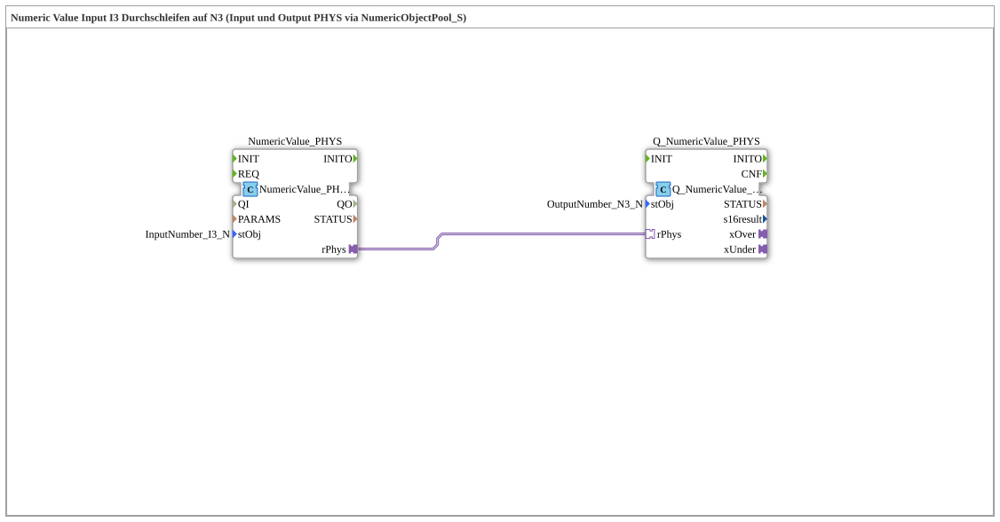

# Uebung_011f_AX: Numeric Value Input I3 Durchschleifen auf N3 (Input und Output PHYS via NumericObjectPool_S)

Dieser Artikel beschreibt die 4diac IDE Subapplikation Uebung_011f_AX (Numeric Value Input I3 Durchschleifen auf N3 (Input und Output PHYS via NumericObjectPool_S)).

----

## Ziel der Übung

Das Ziel dieser Übung ist die Umsetzung folgender Anforderung: **Numeric Value Input I3 Durchschleifen auf N3 (Input und Output PHYS via NumericObjectPool_S)**

-----

## Beschreibung und Komponenten

Die Übung besteht aus der Subapplikation Uebung_011f_AX.SUB, welche die folgende Bausteinstruktur verwendet:

### Verwendete Funktionsbausteine (FBs)

- **NumericValue_PHYS**: Instanz des Typs isobus::UT::io::NumericValue::NumericValue_PHYSA.
  - Parameter stObj = InputNumber_I3_N
- **Q_NumericValue_PHYS**: Instanz des Typs isobus::UT::Q::Q_NumericValue_PHYSA.
  - Parameter stObj = OutputNumber_N3_N

### Verbindungen und Schnittstellen

**Adapterverbindungen:**
- NumericValue_PHYS.rPhys -> Q_NumericValue_PHYS.rPhys

### Hinweise aus dem Modell

> Beispiel: I3-Eingabe -500.00 → rPhys=-500.0 → Q_NumericValue_PHYS(N3) → N3 zeigt -500.00.

-----

## Programmablauf und Funktionsweise

1. **Initialisierung**: Beim Systemstart werden alle beteiligten Bausteine initialisiert.
2. **Ereignis- und Signalverarbeitung**: Zustandsänderungen an den Eingängen erzeugen Ereignisse, die über die definierten Verbindungen an die nachgelagerten Bausteine weitergeleitet werden.
3. **Ausgangsaktualisierung**: Die Zielbausteine verarbeiten die empfangenen Signale und aktualisieren entsprechend die Ausgänge.

-----

## Zusammenfassung

Die Übung Uebung_011f_AX demonstriert anschaulich die modulare IEC 61499 Architektur in 4diac IDE.
