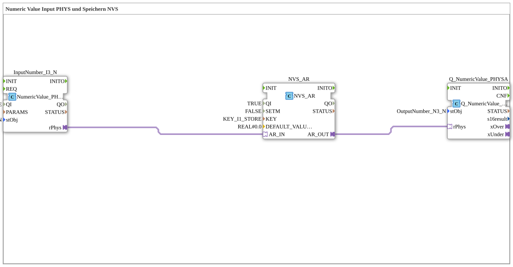

# Uebung_012d_AX: Numeric Value Input PHYS und Speichern NVS

Dieser Artikel beschreibt die 4diac IDE Subapplikation Uebung_012d_AX (Numeric Value Input PHYS und Speichern NVS).

----

## Ziel der Übung

Das Ziel dieser Übung ist die Umsetzung folgender Anforderung: **Numeric Value Input PHYS und Speichern NVS**

-----

## Beschreibung und Komponenten

Die Übung besteht aus der Subapplikation Uebung_012d_AX.SUB, welche die folgende Bausteinstruktur verwendet:

### Verwendete Funktionsbausteine (FBs)

- **InputNumber_I3_N**: Instanz des Typs isobus::UT::io::NumericValue::NumericValue_PHYSA.
  - Parameter QI = TRUE
  - Parameter stObj = InputNumber_I3_N
- **NVS_AR**: Instanz des Typs logiBUS::storage::esp32_nvs::NVS_AR.
  - Parameter QI = TRUE
  - Parameter SETM = FALSE
  - Parameter KEY = KEY_I1_STORE
  - Parameter DEFAULT_VALUE = REAL#0.0
- **Q_NumericValue_PHYSA**: Instanz des Typs isobus::UT::Q::Q_NumericValue_PHYSA.
  - Parameter stObj = OutputNumber_N3_N

### Verbindungen und Schnittstellen

**Adapterverbindungen:**

- NVS_AR.AR_OUT -> Q_NumericValue_PHYSA.rPhys
- InputNumber_I3_N.rPhys -> NVS_AR.AR_IN

-----

## Programmablauf und Funktionsweise

1. **Initialisierung**: Beim Systemstart werden alle beteiligten Bausteine initialisiert.
2. **Ereignis- und Signalverarbeitung**: Zustandsänderungen an den Eingängen erzeugen Ereignisse, die über die definierten Verbindungen an die nachgelagerten Bausteine weitergeleitet werden.
3. **Ausgangsaktualisierung**: Die Zielbausteine verarbeiten die empfangenen Signale und aktualisieren entsprechend die Ausgänge.

-----

## Zusammenfassung

Die Übung Uebung_012d_AX demonstriert anschaulich die modulare IEC 61499 Architektur in 4diac IDE.
