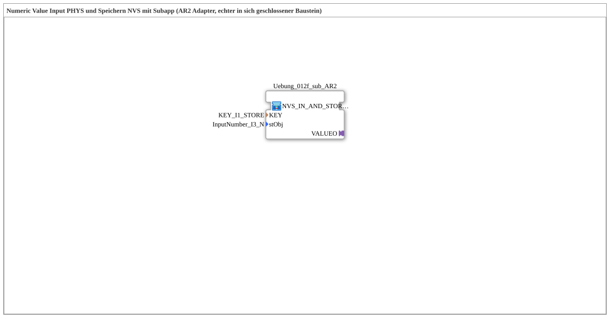

# Uebung_012f_AR2: Numeric Value Input PHYS und Speichern NVS via AR2 mit Subapp

Dieser Artikel beschreibt die logiBUS®-Übung `Uebung_012f_AR2`. Teil einer Serie von Übungen (`Uebung_012d_AR2` bis `Uebung_012o_AR2`), die verschiedene Kombinationen aus Eingabequelle (VT-Feld, OPC-UA oder beides) und Speicherziel (NVS-Flash oder INI-Datei) über den bidirektionalen `AR2`-Adapter demonstrieren.

----

## Ziel der Übung

Einen numerischen Wert aus einem VT-Zahlenfeld (`NumericValue_TO_AR2`) entgegennehmen und dauerhaft in NVS (ESP32-Flash) speichern - unter Verwendung des bidirektionalen AR2-Adapters (als fertig gekapselte Subapp).

-----

## Beschreibung und Komponenten

- **`NVS_IN_AND_STORE_AR2 (Subapp)`**: kapselt VT-/OPC-UA-Eingang, den AR2-Adapter und die Speicherung in NVS (ESP32-Flash) als ein einziger, in sich geschlossener Baustein - die interne Verdrahtung ist nicht als separates FB-Netzwerk sichtbar, sondern vollständig im Baustein selbst gekapselt.

-----

## Funktionsweise

Der Zahlenwert kommt aus einem VT-Zahlenfeld (`NumericValue_TO_AR2`) und wird von `NVS_IN_AND_STORE_AR2 (Subapp)` intern verarbeitet und in NVS (ESP32-Flash) gespeichert, ohne dass die einzelnen Verarbeitungsschritte als separate FB-Instanzen in dieser Subapplikation sichtbar sind.
