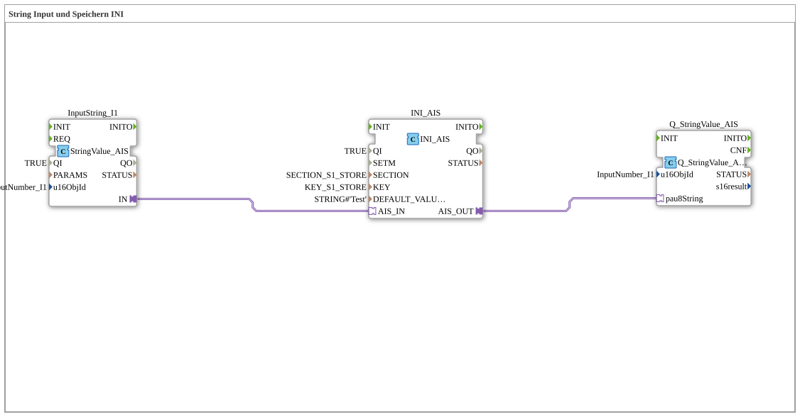

# Uebung_012j_AX: String Input und Speichern INI

Dieser Artikel beschreibt die 4diac IDE Subapplikation Uebung_012j_AX (String Input und Speichern INI).

----

## Ziel der Übung

Das Ziel dieser Übung ist die Umsetzung folgender Anforderung: **String Input und Speichern INI**

-----

## Beschreibung und Komponenten

Die Übung besteht aus der Subapplikation Uebung_012j_AX.SUB, welche die folgende Bausteinstruktur verwendet:

### Verwendete Funktionsbausteine (FBs)

- **InputString_I1**: Instanz des Typs isobus::UT::io::StringValue::StringValue_AIS.
  - Parameter QI = TRUE
  - Parameter u16ObjId = InputNumber_I1
- **INI_AIS**: Instanz des Typs eclipse4diac::storage::INI_AIS.
  - Parameter QI = TRUE
  - Parameter SECTION = SECTION_S1_STORE
  - Parameter KEY = KEY_S1_STORE
  - Parameter DEFAULT_VALUE = STRING#'Test'
- **Q_StringValue_AIS**: Instanz des Typs isobus::UT::Q::Q_StringValue_AIS.
  - Parameter u16ObjId = InputNumber_I1

### Verbindungen und Schnittstellen

**Adapterverbindungen:**

- InputString_I1.IN -> INI_AIS.AIS_IN
- INI_AIS.AIS_OUT -> Q_StringValue_AIS.pau8String

-----

## Programmablauf und Funktionsweise

1. **Initialisierung**: Beim Systemstart werden alle beteiligten Bausteine initialisiert.
2. **Ereignis- und Signalverarbeitung**: Zustandsänderungen an den Eingängen erzeugen Ereignisse, die über die definierten Verbindungen an die nachgelagerten Bausteine weitergeleitet werden.
3. **Ausgangsaktualisierung**: Die Zielbausteine verarbeiten die empfangenen Signale und aktualisieren entsprechend die Ausgänge.

-----

## Zusammenfassung

Die Übung Uebung_012j_AX demonstriert anschaulich die modulare IEC 61499 Architektur in 4diac IDE.
