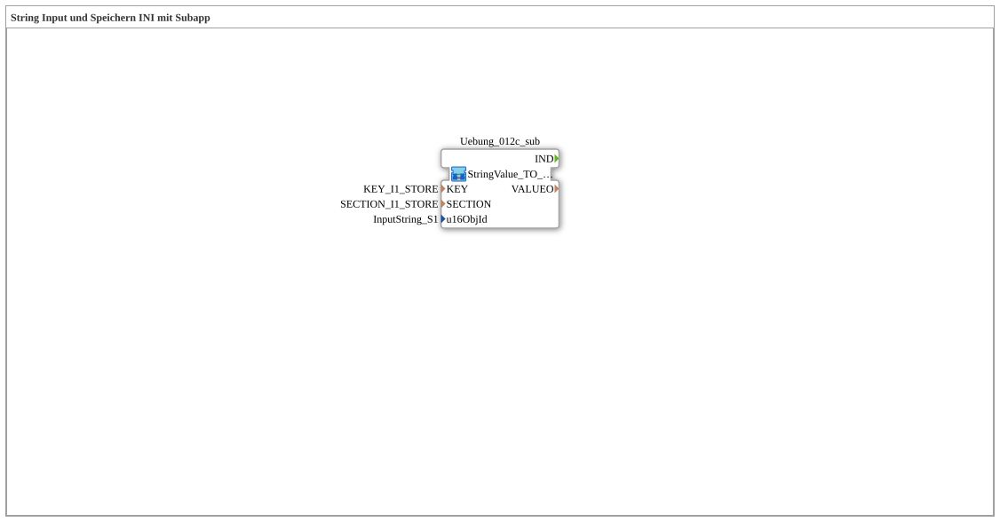

# Uebung_012k_AX: String Input und Speichern INI mit Subapp

Dieser Artikel beschreibt die 4diac IDE Subapplikation Uebung_012k_AX (String Input und Speichern INI mit Subapp).

----

## Ziel der Übung

Das Ziel dieser Übung ist die Umsetzung folgender Anforderung: **String Input und Speichern INI mit Subapp**

-----

## Beschreibung und Komponenten

Die Übung besteht aus der Subapplikation Uebung_012k_AX.SUB, welche die folgende Bausteinstruktur verwendet:

-----

## Programmablauf und Funktionsweise

1. **Initialisierung**: Beim Systemstart werden alle beteiligten Bausteine initialisiert.
2. **Signalweiterleitung**: Die Bausteine verarbeiten Daten- und Steuersignale gemäß ihrer Konfiguration.

-----

## Zusammenfassung

Die Übung Uebung_012k_AX demonstriert anschaulich die modulare IEC 61499 Architektur in 4diac IDE.
