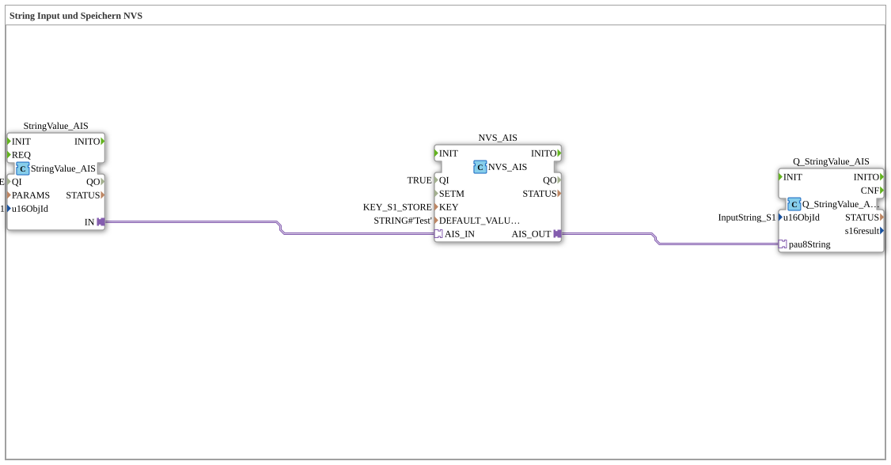

# Uebung_012l_AX: String Input und Speichern NVS

Dieser Artikel beschreibt die 4diac IDE Subapplikation Uebung_012l_AX (String Input und Speichern NVS).

----

## Ziel der Übung

Das Ziel dieser Übung ist die Umsetzung folgender Anforderung: **String Input und Speichern NVS**

-----

## Beschreibung und Komponenten

Die Übung besteht aus der Subapplikation Uebung_012l_AX.SUB, welche die folgende Bausteinstruktur verwendet:

### Verwendete Funktionsbausteine (FBs)

- **StringValue_AIS**: Instanz des Typs isobus::UT::io::StringValue::StringValue_AIS.
  - Parameter QI = TRUE
  - Parameter u16ObjId = InputString_S1
- **NVS_AIS**: Instanz des Typs logiBUS::storage::esp32_nvs::NVS_AIS.
  - Parameter QI = TRUE
  - Parameter KEY = KEY_S1_STORE
  - Parameter DEFAULT_VALUE = STRING#'Test'
- **Q_StringValue_AIS**: Instanz des Typs isobus::UT::Q::Q_StringValue_AIS.
  - Parameter u16ObjId = InputString_S1

### Verbindungen und Schnittstellen

**Adapterverbindungen:**
- StringValue_AIS.IN -> NVS_AIS.AIS_IN
- NVS_AIS.AIS_OUT -> Q_StringValue_AIS.pau8String

-----

## Programmablauf und Funktionsweise

1. **Initialisierung**: Beim Systemstart werden alle beteiligten Bausteine initialisiert.
2. **Ereignis- und Signalverarbeitung**: Zustandsänderungen an den Eingängen erzeugen Ereignisse, die über die definierten Verbindungen an die nachgelagerten Bausteine weitergeleitet werden.
3. **Ausgangsaktualisierung**: Die Zielbausteine verarbeiten die empfangenen Signale und aktualisieren entsprechend die Ausgänge.

-----

## Zusammenfassung

Die Übung Uebung_012l_AX demonstriert anschaulich die modulare IEC 61499 Architektur in 4diac IDE.
