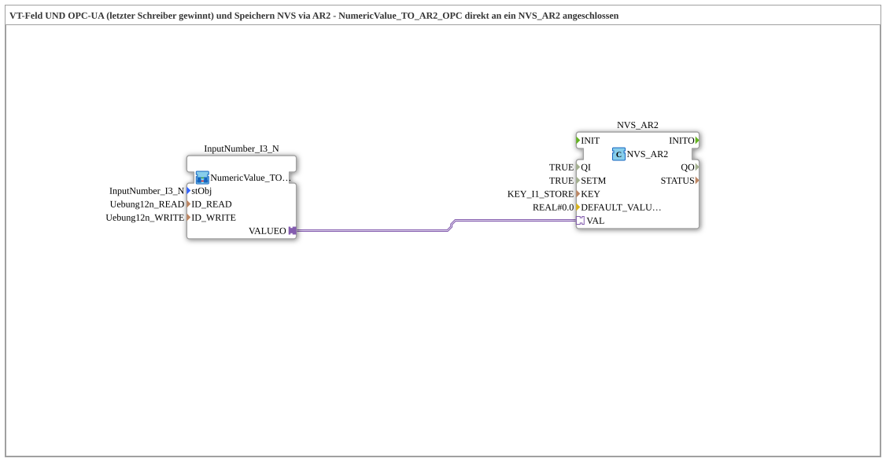

# Uebung_012n_AR2: Numeric Value Input PHYS und Speichern NVS via AR2 (bidirektional, direkt)

Dieser Artikel beschreibt die logiBUS®-Übung `Uebung_012n_AR2`. Teil einer Serie von Übungen (`Uebung_012d_AR2` bis `Uebung_012o_AR2`), die verschiedene Kombinationen aus Eingabequelle (VT-Feld, OPC-UA oder beides) und Speicherziel (NVS-Flash oder INI-Datei) über den bidirektionalen `AR2`-Adapter demonstrieren.

----

## Ziel der Übung

Einen numerischen Wert sowohl über ein VT-Zahlenfeld (`NumericValue_TO_AR2_OPC`) als auch über OPC-UA - wer zuletzt schreibt, gewinnt (`SETM = TRUE`) entgegennehmen und dauerhaft in NVS (ESP32-Flash) speichern - unter Verwendung des bidirektionalen AR2-Adapters (direkt verdrahtet, ohne Subapp-Kapselung).

-----

## Beschreibung und Komponenten

- **`NVS_AR2`**: `logiBUS::storage::esp32_nvs::NVS_AR2`, bidirektionaler AR2-Adapter-Baustein, der den Wert direkt persistiert.

-----

## Funktionsweise

Der Zahlenwert wird sowohl über ein VT-Zahlenfeld (`NumericValue_TO_AR2_OPC`) als auch über OPC-UA - wer zuletzt schreibt, gewinnt (`SETM = TRUE`) direkt über den bidirektionalen `AR2`-Adapter an `NVS_AR2` weitergegeben, der ihn in NVS (ESP32-Flash) speichert - ohne Zwischenschritt über eine separate Subapp.
