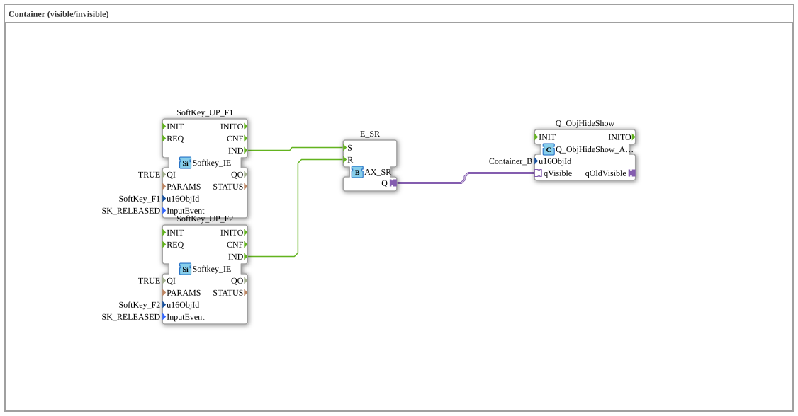

# Uebung_014_AX: Container (visible/invisible)

Dieser Artikel beschreibt die 4diac IDE Subapplikation Uebung_014_AX (Container (visible/invisible)).

----

## Ziel der Übung

Das Ziel dieser Übung ist die Umsetzung folgender Anforderung: **Container (visible/invisible)**

-----

## Beschreibung und Komponenten

Die Übung besteht aus der Subapplikation Uebung_014_AX.SUB, welche die folgende Bausteinstruktur verwendet:

### Verwendete Funktionsbausteine (FBs)

- **SoftKey_UP_F1**: Instanz des Typs isobus::UT::io::Softkey::Softkey_IE.
  - Parameter QI = TRUE
  - Parameter u16ObjId = SoftKey_F1
  - Parameter InputEvent = SK_RELEASED
- **SoftKey_UP_F2**: Instanz des Typs isobus::UT::io::Softkey::Softkey_IE.
  - Parameter QI = TRUE
  - Parameter u16ObjId = SoftKey_F2
  - Parameter InputEvent = SK_RELEASED
- **E_SR**: Instanz des Typs adapter::events::unidirectional::AX_SR.
- **Q_ObjHideShow**: Instanz des Typs isobus::UT::Q::Q_ObjHideShow_AX.
  - Parameter u16ObjId = Container_B

### Verbindungen und Schnittstellen

**Adapterverbindungen:**

- E_SR.Q -> Q_ObjHideShow.qVisible

**Ereignisverbindungen:**

- SoftKey_UP_F1.IND -> E_SR.S
- SoftKey_UP_F2.IND -> E_SR.R

-----

## Programmablauf und Funktionsweise

1. **Initialisierung**: Beim Systemstart werden alle beteiligten Bausteine initialisiert.
2. **Ereignis- und Signalverarbeitung**: Zustandsänderungen an den Eingängen erzeugen Ereignisse, die über die definierten Verbindungen an die nachgelagerten Bausteine weitergeleitet werden.
3. **Ausgangsaktualisierung**: Die Zielbausteine verarbeiten die empfangenen Signale und aktualisieren entsprechend die Ausgänge.

-----

## Zusammenfassung

Die Übung Uebung_014_AX demonstriert anschaulich die modulare IEC 61499 Architektur in 4diac IDE.
