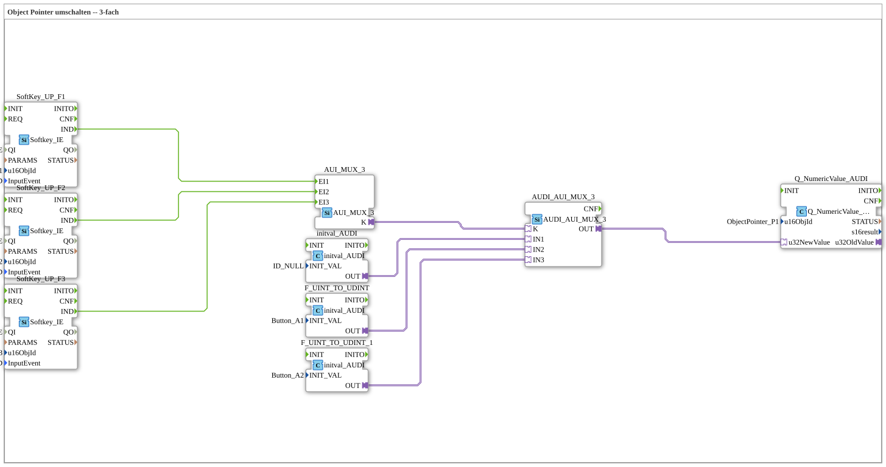

# Uebung_015a_AX: Object Pointer umschalten -- 3-fach

Dieser Artikel beschreibt die 4diac IDE Subapplikation Uebung_015a_AX (Object Pointer umschalten -- 3-fach).

----

## Ziel der Übung

Das Ziel dieser Übung ist die Umsetzung folgender Anforderung: **Object Pointer umschalten -- 3-fach**

-----

## Beschreibung und Komponenten

Die Übung besteht aus der Subapplikation Uebung_015a_AX.SUB, welche die folgende Bausteinstruktur verwendet:

### Verwendete Funktionsbausteine (FBs)

- **SoftKey_UP_F1**: Instanz des Typs isobus::UT::io::Softkey::Softkey_IE.
  - Parameter QI = TRUE
  - Parameter u16ObjId = SoftKey_F1
  - Parameter InputEvent = SK_RELEASED
- **SoftKey_UP_F2**: Instanz des Typs isobus::UT::io::Softkey::Softkey_IE.
  - Parameter QI = TRUE
  - Parameter u16ObjId = SoftKey_F2
  - Parameter InputEvent = SK_RELEASED
- **F_UINT_TO_UDINT**: Instanz des Typs adapter::types::unidirectional::AUDI::initval::initval_AUDI.
  - Parameter INIT_VAL = Button_A1
- **Q_NumericValue_AUDI**: Instanz des Typs isobus::UT::Q::Q_NumericValue_AUDI.
  - Parameter u16ObjId = ObjectPointer_P1
- **SoftKey_UP_F3**: Instanz des Typs isobus::UT::io::Softkey::Softkey_IE.
  - Parameter QI = TRUE
  - Parameter u16ObjId = SoftKey_F3
  - Parameter InputEvent = SK_RELEASED
- **F_UINT_TO_UDINT_1**: Instanz des Typs adapter::types::unidirectional::AUDI::initval::initval_AUDI.
  - Parameter INIT_VAL = Button_A2
- **initval_AUDI**: Instanz des Typs adapter::types::unidirectional::AUDI::initval::initval_AUDI.
  - Parameter INIT_VAL = ID_NULL
- **AUDI_AUI_MUX_3**: Instanz des Typs adapter::selection::unidirectional::AUDI_AUI_MUX_3.
- **AUI_MUX_3**: Instanz des Typs adapter::events::unidirectional::AUI_MUX_3.

### Verbindungen und Schnittstellen

**Adapterverbindungen:**
- AUDI_AUI_MUX_3.OUT -> Q_NumericValue_AUDI.u32NewValue
- F_UINT_TO_UDINT_1.OUT -> AUDI_AUI_MUX_3.IN3
- F_UINT_TO_UDINT.OUT -> AUDI_AUI_MUX_3.IN2
- initval_AUDI.OUT -> AUDI_AUI_MUX_3.IN1
- AUI_MUX_3.K -> AUDI_AUI_MUX_3.K

**Ereignisverbindungen:**
- SoftKey_UP_F1.IND -> AUI_MUX_3.EI1
- SoftKey_UP_F2.IND -> AUI_MUX_3.EI2
- SoftKey_UP_F3.IND -> AUI_MUX_3.EI3

-----

## Programmablauf und Funktionsweise

1. **Initialisierung**: Beim Systemstart werden alle beteiligten Bausteine initialisiert.
2. **Ereignis- und Signalverarbeitung**: Zustandsänderungen an den Eingängen erzeugen Ereignisse, die über die definierten Verbindungen an die nachgelagerten Bausteine weitergeleitet werden.
3. **Ausgangsaktualisierung**: Die Zielbausteine verarbeiten die empfangenen Signale und aktualisieren entsprechend die Ausgänge.

-----

## Zusammenfassung

Die Übung Uebung_015a_AX demonstriert anschaulich die modulare IEC 61499 Architektur in 4diac IDE.
