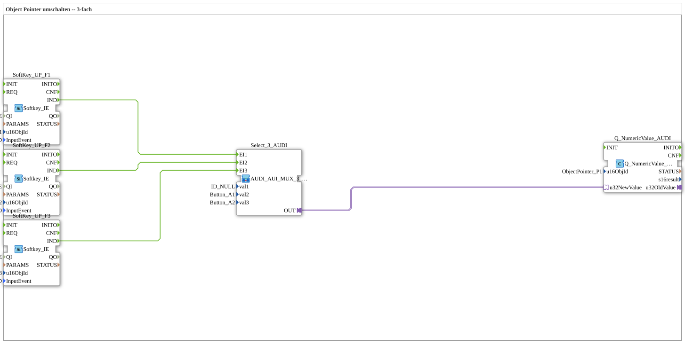

# Uebung_015b_AX: Object Pointer umschalten -- 3-fach

Dieser Artikel beschreibt die 4diac IDE Subapplikation Uebung_015b_AX (Object Pointer umschalten -- 3-fach).

----

## Ziel der Übung

Das Ziel dieser Übung ist die Umsetzung folgender Anforderung: **Object Pointer umschalten -- 3-fach**

-----

## Beschreibung und Komponenten

Die Übung besteht aus der Subapplikation Uebung_015b_AX.SUB, welche die folgende Bausteinstruktur verwendet:

### Verwendete Funktionsbausteine (FBs)

- **SoftKey_UP_F1**: Instanz des Typs isobus::UT::io::Softkey::Softkey_IE.
  - Parameter QI = TRUE
  - Parameter u16ObjId = SoftKey_F1
  - Parameter InputEvent = SK_RELEASED
- **SoftKey_UP_F2**: Instanz des Typs isobus::UT::io::Softkey::Softkey_IE.
  - Parameter QI = TRUE
  - Parameter u16ObjId = SoftKey_F2
  - Parameter InputEvent = SK_RELEASED
- **SoftKey_UP_F3**: Instanz des Typs isobus::UT::io::Softkey::Softkey_IE.
  - Parameter QI = TRUE
  - Parameter u16ObjId = SoftKey_F3
  - Parameter InputEvent = SK_RELEASED
- **Q_NumericValue_AUDI**: Instanz des Typs isobus::UT::Q::Q_NumericValue_AUDI.
  - Parameter u16ObjId = ObjectPointer_P1

### Verbindungen und Schnittstellen

**Adapterverbindungen:**
- Select_3_AUDI.OUT -> Q_NumericValue_AUDI.u32NewValue

**Ereignisverbindungen:**
- SoftKey_UP_F1.IND -> Select_3_AUDI.EI1
- SoftKey_UP_F2.IND -> Select_3_AUDI.EI2
- SoftKey_UP_F3.IND -> Select_3_AUDI.EI3

-----

## Programmablauf und Funktionsweise

1. **Initialisierung**: Beim Systemstart werden alle beteiligten Bausteine initialisiert.
2. **Ereignis- und Signalverarbeitung**: Zustandsänderungen an den Eingängen erzeugen Ereignisse, die über die definierten Verbindungen an die nachgelagerten Bausteine weitergeleitet werden.
3. **Ausgangsaktualisierung**: Die Zielbausteine verarbeiten die empfangenen Signale und aktualisieren entsprechend die Ausgänge.

-----

## Zusammenfassung

Die Übung Uebung_015b_AX demonstriert anschaulich die modulare IEC 61499 Architektur in 4diac IDE.
