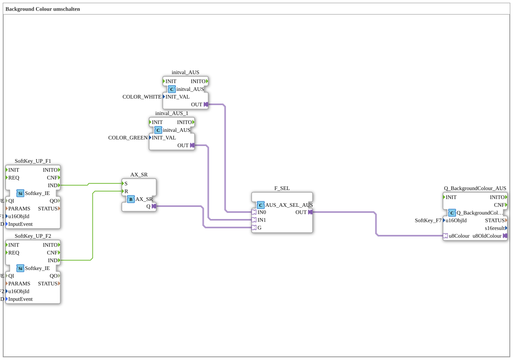

# Uebung_016_AX: Background Colour umschalten

Dieser Artikel beschreibt die 4diac IDE Subapplikation Uebung_016_AX (Background Colour umschalten).

----

## Ziel der Übung

Das Ziel dieser Übung ist die Umsetzung folgender Anforderung: **Background Colour umschalten**

-----

## Beschreibung und Komponenten

Die Übung besteht aus der Subapplikation Uebung_016_AX.SUB, welche die folgende Bausteinstruktur verwendet:

### Verwendete Funktionsbausteine (FBs)

- **SoftKey_UP_F1**: Instanz des Typs isobus::UT::io::Softkey::Softkey_IE.
  - Parameter QI = TRUE
  - Parameter u16ObjId = SoftKey_F1
  - Parameter InputEvent = SK_RELEASED
- **SoftKey_UP_F2**: Instanz des Typs isobus::UT::io::Softkey::Softkey_IE.
  - Parameter QI = TRUE
  - Parameter u16ObjId = SoftKey_F2
  - Parameter InputEvent = SK_RELEASED
- **AX_SR**: Instanz des Typs adapter::events::unidirectional::AX_SR.
- **F_SEL**: Instanz des Typs adapter::iec61131::selection::AUS_AX_SEL_AUS.
- **Q_BackgroundColour_AUS**: Instanz des Typs isobus::UT::Q::Q_BackgroundColour_AUS.
  - Parameter u16ObjId = SoftKey_F7
- **initval_AUS**: Instanz des Typs adapter::types::unidirectional::AUS::initval::initval_AUS.
  - Parameter INIT_VAL = COLOR_WHITE
- **initval_AUS_1**: Instanz des Typs adapter::types::unidirectional::AUS::initval::initval_AUS.
  - Parameter INIT_VAL = COLOR_GREEN

### Verbindungen und Schnittstellen

**Adapterverbindungen:**

- AX_SR.Q -> F_SEL.G
- F_SEL.OUT -> Q_BackgroundColour_AUS.u8Colour
- initval_AUS_1.OUT -> F_SEL.IN1
- initval_AUS.OUT -> F_SEL.IN0

**Ereignisverbindungen:**

- SoftKey_UP_F1.IND -> AX_SR.S
- SoftKey_UP_F2.IND -> AX_SR.R

-----

## Programmablauf und Funktionsweise

1. **Initialisierung**: Beim Systemstart werden alle beteiligten Bausteine initialisiert.
2. **Ereignis- und Signalverarbeitung**: Zustandsänderungen an den Eingängen erzeugen Ereignisse, die über die definierten Verbindungen an die nachgelagerten Bausteine weitergeleitet werden.
3. **Ausgangsaktualisierung**: Die Zielbausteine verarbeiten die empfangenen Signale und aktualisieren entsprechend die Ausgänge.

-----

## Zusammenfassung

Die Übung Uebung_016_AX demonstriert anschaulich die modulare IEC 61499 Architektur in 4diac IDE.
