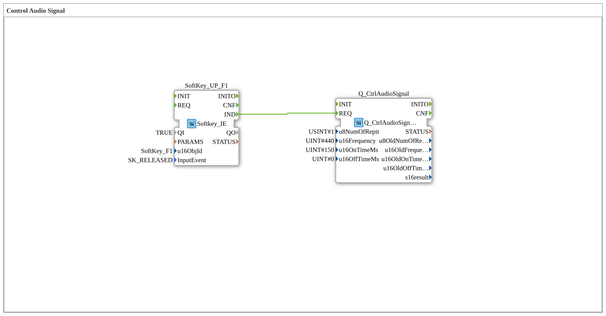

# Uebung_017_AX: Control Audio Signal

Dieser Artikel beschreibt die 4diac IDE Subapplikation Uebung_017_AX (Control Audio Signal).

----

## Ziel der Übung

Das Ziel dieser Übung ist die Umsetzung folgender Anforderung: **Control Audio Signal**

-----

## Beschreibung und Komponenten

Die Übung besteht aus der Subapplikation Uebung_017_AX.SUB, welche die folgende Bausteinstruktur verwendet:

### Verwendete Funktionsbausteine (FBs)

- **SoftKey_UP_F1**: Instanz des Typs isobus::UT::io::Softkey::Softkey_IE.
  - Parameter QI = TRUE
  - Parameter u16ObjId = SoftKey_F1
  - Parameter InputEvent = SK_RELEASED
- **Q_CtrlAudioSignal**: Instanz des Typs isobus::UT::Q::Q_CtrlAudioSignal.
  - Parameter u8NumOfRepit = 1
  - Parameter u16Frequency = 440
  - Parameter u16OnTimeMs = 150
  - Parameter u16OffTimeMs = 0

### Verbindungen und Schnittstellen

**Ereignisverbindungen:**
- SoftKey_UP_F1.IND -> Q_CtrlAudioSignal.REQ

-----

## Programmablauf und Funktionsweise

1. **Initialisierung**: Beim Systemstart werden alle beteiligten Bausteine initialisiert.
2. **Ereignis- und Signalverarbeitung**: Zustandsänderungen an den Eingängen erzeugen Ereignisse, die über die definierten Verbindungen an die nachgelagerten Bausteine weitergeleitet werden.
3. **Ausgangsaktualisierung**: Die Zielbausteine verarbeiten die empfangenen Signale und aktualisieren entsprechend die Ausgänge.

-----

## Zusammenfassung

Die Übung Uebung_017_AX demonstriert anschaulich die modulare IEC 61499 Architektur in 4diac IDE.
