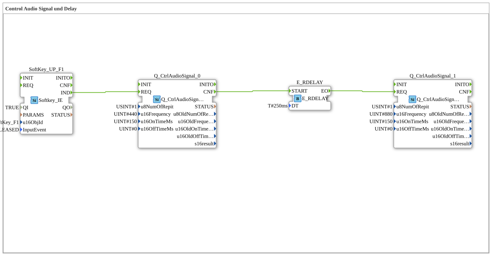

# Uebung_018a_AX: Control Audio Signal und Delay

Dieser Artikel beschreibt die 4diac IDE Subapplikation Uebung_018a_AX (Control Audio Signal und Delay).

----

## Ziel der Übung

Das Ziel dieser Übung ist die Umsetzung folgender Anforderung: **Control Audio Signal und Delay**

-----

## Beschreibung und Komponenten

Die Übung besteht aus der Subapplikation Uebung_018a_AX.SUB, welche die folgende Bausteinstruktur verwendet:

### Verwendete Funktionsbausteine (FBs)

- **SoftKey_UP_F1**: Instanz des Typs isobus::UT::io::Softkey::Softkey_IE.
  - Parameter QI = TRUE
  - Parameter u16ObjId = SoftKey_F1
  - Parameter InputEvent = SK_RELEASED
- **Q_CtrlAudioSignal_0**: Instanz des Typs isobus::UT::Q::Q_CtrlAudioSignal.
  - Parameter u8NumOfRepit = 1
  - Parameter u16Frequency = 440
  - Parameter u16OnTimeMs = 150
  - Parameter u16OffTimeMs = 0
- **Q_CtrlAudioSignal_1**: Instanz des Typs isobus::UT::Q::Q_CtrlAudioSignal.
  - Parameter u8NumOfRepit = 1
  - Parameter u16Frequency = 880
  - Parameter u16OnTimeMs = 150
  - Parameter u16OffTimeMs = 0
- **E_RDELAY**: Instanz des Typs iec61499::events::E_RDELAY.
  - Parameter DT = T#250ms

### Verbindungen und Schnittstellen

**Ereignisverbindungen:**
- SoftKey_UP_F1.IND -> Q_CtrlAudioSignal_0.REQ
- E_RDELAY.EO -> Q_CtrlAudioSignal_1.REQ
- Q_CtrlAudioSignal_0.CNF -> E_RDELAY.START

-----

## Programmablauf und Funktionsweise

1. **Initialisierung**: Beim Systemstart werden alle beteiligten Bausteine initialisiert.
2. **Ereignis- und Signalverarbeitung**: Zustandsänderungen an den Eingängen erzeugen Ereignisse, die über die definierten Verbindungen an die nachgelagerten Bausteine weitergeleitet werden.
3. **Ausgangsaktualisierung**: Die Zielbausteine verarbeiten die empfangenen Signale und aktualisieren entsprechend die Ausgänge.

-----

## Zusammenfassung

Die Übung Uebung_018a_AX demonstriert anschaulich die modulare IEC 61499 Architektur in 4diac IDE.
