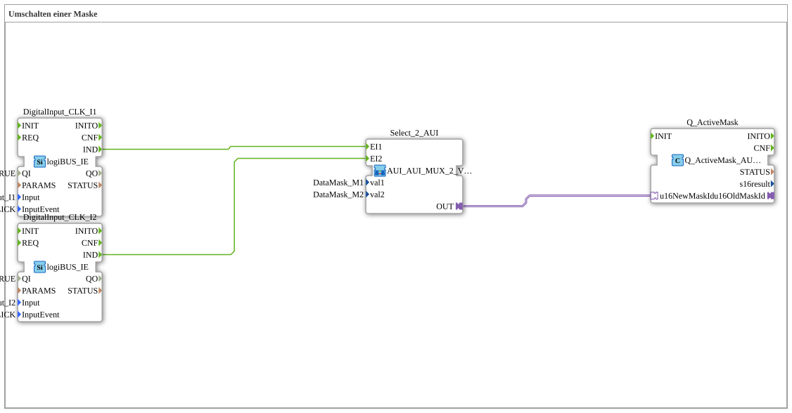

# Uebung_019_AX: Umschalten einer Maske

Dieser Artikel beschreibt die 4diac IDE Subapplikation Uebung_019_AX (Umschalten einer Maske).

----

## Ziel der Übung

Das Ziel dieser Übung ist die Umsetzung folgender Anforderung: **Umschalten einer Maske**

-----

## Beschreibung und Komponenten

Die Übung besteht aus der Subapplikation Uebung_019_AX.SUB, welche die folgende Bausteinstruktur verwendet:

### Verwendete Funktionsbausteine (FBs)

- **DigitalInput_CLK_I1**: Instanz des Typs logiBUS::io::DI::logiBUS_IE.
  - Parameter QI = TRUE
  - Parameter Input = Input_I1
  - Parameter InputEvent = BUTTON_SINGLE_CLICK
- **DigitalInput_CLK_I2**: Instanz des Typs logiBUS::io::DI::logiBUS_IE.
  - Parameter QI = TRUE
  - Parameter Input = Input_I2
  - Parameter InputEvent = BUTTON_SINGLE_CLICK
- **Q_ActiveMask**: Instanz des Typs isobus::UT::Q::Q_ActiveMask_AUI.

### Verbindungen und Schnittstellen

**Adapterverbindungen:**

- Select_2_AUI.OUT -> Q_ActiveMask.u16NewMaskId

**Ereignisverbindungen:**

- DigitalInput_CLK_I1.IND -> Select_2_AUI.EI1
- DigitalInput_CLK_I2.IND -> Select_2_AUI.EI2

-----

## Programmablauf und Funktionsweise

1. **Initialisierung**: Beim Systemstart werden alle beteiligten Bausteine initialisiert.
2. **Ereignis- und Signalverarbeitung**: Zustandsänderungen an den Eingängen erzeugen Ereignisse, die über die definierten Verbindungen an die nachgelagerten Bausteine weitergeleitet werden.
3. **Ausgangsaktualisierung**: Die Zielbausteine verarbeiten die empfangenen Signale und aktualisieren entsprechend die Ausgänge.

-----

## Zusammenfassung

Die Übung Uebung_019_AX demonstriert anschaulich die modulare IEC 61499 Architektur in 4diac IDE.
