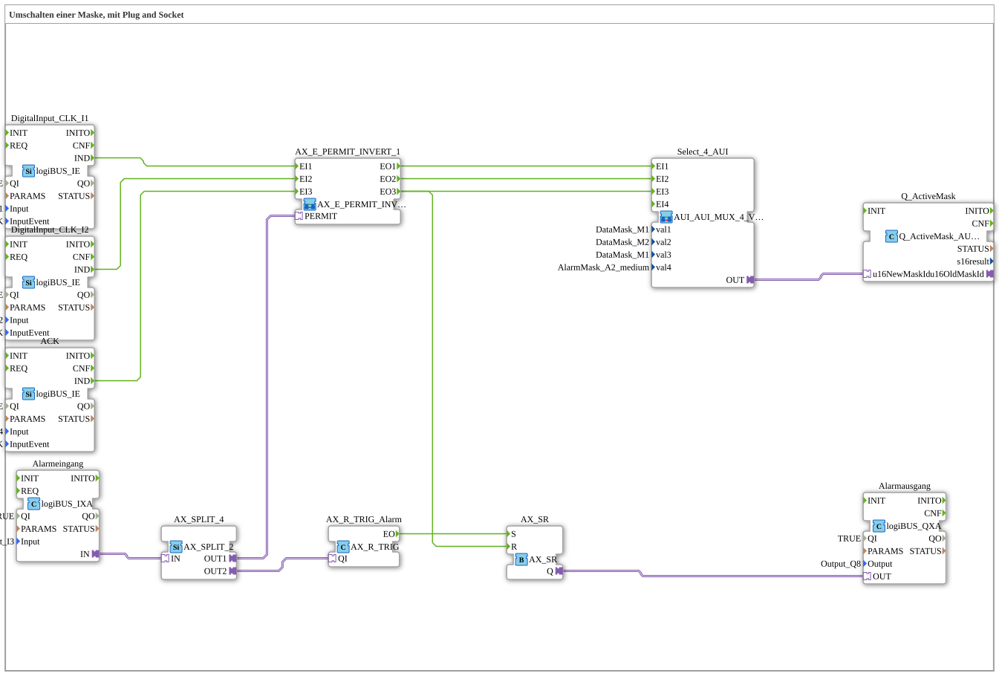

# Uebung_019c_AX: Umschalten einer Maske, mit Plug and Socket

Dieser Artikel beschreibt die 4diac IDE Subapplikation Uebung_019c_AX (Umschalten einer Maske, mit Plug and Socket).

----

## Ziel der Übung

Das Ziel dieser Übung ist die Umsetzung folgender Anforderung: **Umschalten einer Maske, mit Plug and Socket**

-----

## Beschreibung und Komponenten

Die Übung besteht aus der Subapplikation Uebung_019c_AX.SUB, welche die folgende Bausteinstruktur verwendet:

### Verwendete Funktionsbausteine (FBs)

- **DigitalInput_CLK_I1**: Instanz des Typs logiBUS::io::DI::logiBUS_IE.
  - Parameter QI = TRUE
  - Parameter Input = Input_I1
  - Parameter InputEvent = BUTTON_SINGLE_CLICK
- **DigitalInput_CLK_I2**: Instanz des Typs logiBUS::io::DI::logiBUS_IE.
  - Parameter QI = TRUE
  - Parameter Input = Input_I2
  - Parameter InputEvent = BUTTON_SINGLE_CLICK
- **Q_ActiveMask**: Instanz des Typs isobus::UT::Q::Q_ActiveMask_AUI.
- **ACK**: Instanz des Typs logiBUS::io::DI::logiBUS_IE.
  - Parameter QI = TRUE
  - Parameter Input = Input_I4
  - Parameter InputEvent = BUTTON_SINGLE_CLICK
- **AX_SR**: Instanz des Typs adapter::events::unidirectional::AX_SR.
- **Alarmausgang**: Instanz des Typs logiBUS::io::DQ::logiBUS_QXA.
  - Parameter QI = TRUE
  - Parameter Output = Output_Q8
- **Alarmeingang**: Instanz des Typs logiBUS::io::DI::logiBUS_IXA.
  - Parameter QI = TRUE
  - Parameter Input = Input_I3
- **AX_R_TRIG_Alarm**: Instanz des Typs adapter::events::unidirectional::AX_R_TRIG.
- **AX_SPLIT_4**: Instanz des Typs adapter::events::unidirectional::AX_SPLIT_2.

### Verbindungen und Schnittstellen

**Adapterverbindungen:**

- Select_4_AUI.OUT -> Q_ActiveMask.u16NewMaskId
- AX_SR.Q -> Alarmausgang.OUT
- Alarmeingang.IN -> AX_SPLIT_4.IN
- AX_SPLIT_4.OUT1 -> AX_E_PERMIT_INVERT_1.PERMIT
- AX_SPLIT_4.OUT2 -> AX_R_TRIG_Alarm.QI

**Ereignisverbindungen:**

- AX_R_TRIG_Alarm.EO -> AX_SR.S
- ACK.IND -> AX_E_PERMIT_INVERT_1.EI3
- DigitalInput_CLK_I1.IND -> AX_E_PERMIT_INVERT_1.EI1
- DigitalInput_CLK_I2.IND -> AX_E_PERMIT_INVERT_1.EI2
- AX_E_PERMIT_INVERT_1.EO3 -> AX_SR.R
- AX_E_PERMIT_INVERT_1.EO3 -> Select_4_AUI.EI3
- AX_E_PERMIT_INVERT_1.EO2 -> Select_4_AUI.EI2
- AX_E_PERMIT_INVERT_1.EO1 -> Select_4_AUI.EI1

-----

## Programmablauf und Funktionsweise

1. **Initialisierung**: Beim Systemstart werden alle beteiligten Bausteine initialisiert.
2. **Ereignis- und Signalverarbeitung**: Zustandsänderungen an den Eingängen erzeugen Ereignisse, die über die definierten Verbindungen an die nachgelagerten Bausteine weitergeleitet werden.
3. **Ausgangsaktualisierung**: Die Zielbausteine verarbeiten die empfangenen Signale und aktualisieren entsprechend die Ausgänge.

-----

## Zusammenfassung

Die Übung Uebung_019c_AX demonstriert anschaulich die modulare IEC 61499 Architektur in 4diac IDE.
