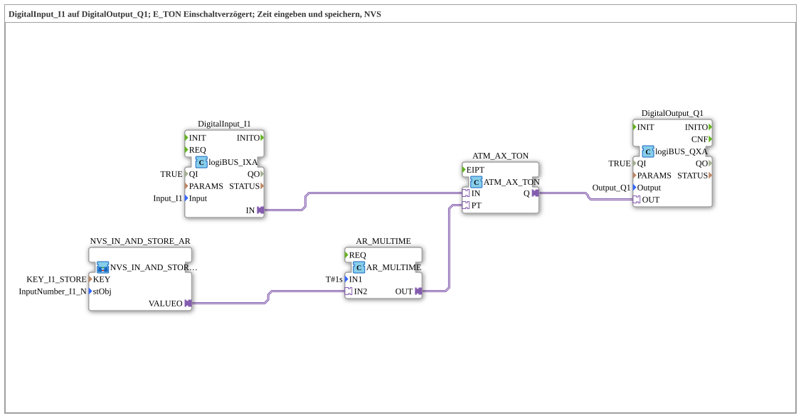

# Uebung_020c2_AX: Einschaltverzögerung mit einstellbarer, NVS-gespeicherter Zeit (AX)

Dieser Artikel beschreibt die logiBUS®-Übung `Uebung_020c2_AX`. Wir bauen eine einschaltverzögerte Schaltung, deren Verzögerungszeit über das ISOBUS-Terminal eingestellt und dauerhaft im ESP32-Flash gespeichert wird.

----

## Ziel der Übung

`DigitalInput_I1` schaltet `DigitalOutput_Q1` erst nach einer einstellbaren Verzögerung (`E_TON`, hier als AX-Adapter `ATM_AX_TON`). Die Verzögerungszeit ist über das VT-Terminal einstellbar und wird per NVS (Non-Volatile Storage, ESP32-Flash) dauerhaft gespeichert, sodass sie einen Neustart übersteht.

-----

## Beschreibung und Komponenten

- **`DigitalInput_I1`**: `logiBUS::io::DI::logiBUS_IXA`, physischer Taster/Schalter.
- **`ATM_AX_TON`**: `adapter::events::unidirectional::timers::ATM_AX_TON`, AX-Adaptervariante des Einschaltverzögerungs-Timers `E_TON`.
- **`AR_MULTIME`**: `adapter::iec61131::arithmetic::AR_MULTIME`, multipliziert den vom Bediener eingegebenen Zeitwert mit einer Zeitbasis, um die tatsächliche `PT` (Preset Time) für den Timer zu berechnen.
- **`NVS_IN_AND_STORE_AR`**: liest den vom Bediener über das VT eingegebenen Zahlenwert und speichert ihn dauerhaft im ESP32-Flash (`KEY_I1_STORE`).
- **`DigitalOutput_Q1`**: `logiBUS::io::DQ::logiBUS_QXA`.

-----

## Funktionsweise

1. Der Bediener gibt am ISOBUS-Terminal einen Zahlenwert ein, der über `NVS_IN_AND_STORE_AR` sofort im ESP32-Flash gespeichert wird.
2. `AR_MULTIME` berechnet daraus die tatsächliche Verzögerungszeit (`PT`) für `ATM_AX_TON`.
3. Sobald `DigitalInput_I1` aktiv wird, startet `ATM_AX_TON` die Verzögerung.
4. Nach Ablauf der (gespeicherten) Zeit schaltet `DigitalOutput_Q1` ein.
5. Die gespeicherte Zeit bleibt auch nach einem Neustart des Controllers erhalten.
