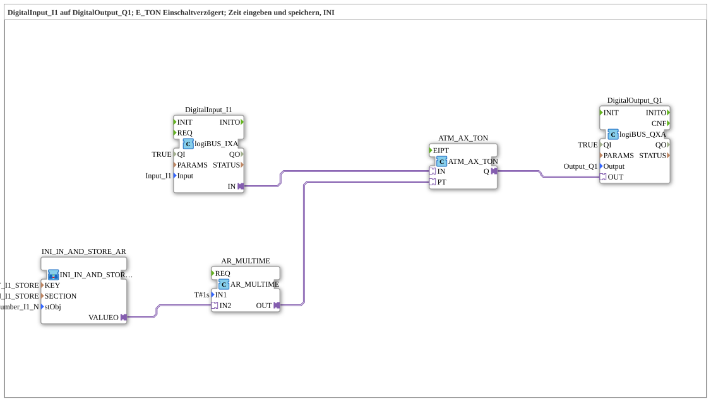

# Uebung_020c4_AX: Einschaltverzögerung mit einstellbarer, INI-gespeicherter Zeit (AX)

Dieser Artikel beschreibt die logiBUS®-Übung `Uebung_020c4_AX`. Diese Übung entspricht `Uebung_020c2_AX` (siehe dort für die generelle Funktionsweise), speichert die vom Bediener eingegebene Verzögerungszeit aber statt in NVS (ESP32-Flash) in einer INI-Datei.

----

## Ziel der Übung

`DigitalInput_I1` schaltet `DigitalOutput_Q1` erst nach einer einstellbaren, über das VT-Terminal eingegebenen Verzögerung. Die Zeit wird über `INI_IN_AND_STORE_AR` in einer INI-Datei (Abschnitt `SECTION_I1_STORE`, Schlüssel `KEY_I1_STORE`) dauerhaft gespeichert.

-----

## Beschreibung und Komponenten

- **`DigitalInput_I1`**: `logiBUS::io::DI::logiBUS_IXA`.
- **`ATM_AX_TON`**: `adapter::events::unidirectional::timers::ATM_AX_TON`, AX-Adapter-Einschaltverzögerung.
- **`AR_MULTIME`**: `adapter::iec61131::arithmetic::AR_MULTIME`, berechnet die tatsächliche `PT` (Preset Time) aus dem gespeicherten Wert.
- **`INI_IN_AND_STORE_AR`**: liest den vom Bediener eingegebenen Wert und speichert ihn in einer INI-Datei statt in NVS.
- **`DigitalOutput_Q1`**: `logiBUS::io::DQ::logiBUS_QXA`.

-----

## Funktionsweise

1. Der Bediener gibt am ISOBUS-Terminal einen Zahlenwert ein, der über `INI_IN_AND_STORE_AR` sofort in die INI-Datei geschrieben wird.
2. `AR_MULTIME` berechnet daraus die tatsächliche Verzögerungszeit (`PT`) für `ATM_AX_TON`.
3. Sobald `DigitalInput_I1` aktiv wird, startet `ATM_AX_TON` die Verzögerung.
4. Nach Ablauf der gespeicherten Zeit schaltet `DigitalOutput_Q1` ein.
5. Die gespeicherte Zeit übersteht einen Neustart des Controllers.
