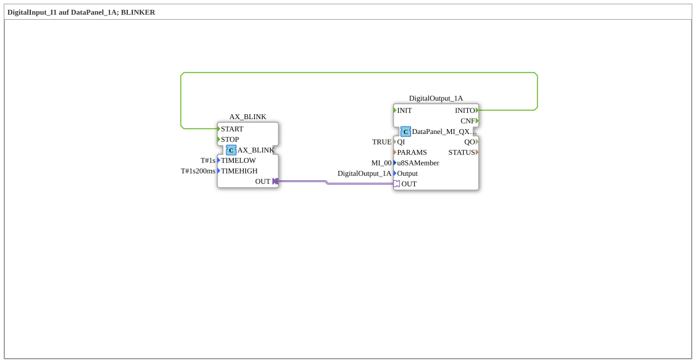

# Uebung_020f4_AX: Blinklicht auf DataPanel-Ausgang (AX)

Dieser Artikel beschreibt die logiBUS®-Übung `Uebung_020f4_AX`. Wir bauen einen einfachen Blinker auf einem DataPanel-Ausgang.

----

## Ziel der Übung

Ein DataPanel-Ausgang (`DigitalOutput_1A`) blinkt dauerhaft mit fest eingestellten Ein-/Aus-Zeiten, sobald er initialisiert wurde.

-----

## Beschreibung und Komponenten

- **`DigitalOutput_1A`**: `DataPanel::io::MI::DQ::DataPanel_MI_QXA`, Ausgang auf dem DataPanel-Erweiterungsmodul (`u8SAMember = MI_00`).
- **`AX_BLINK`**: `adapter::events::unidirectional::signals::AX_BLINK`, erzeugt ein periodisches Ein/Aus-Signal mit `TIMELOW = T#1s` und `TIMEHIGH = T#1s200ms`.

-----

## Funktionsweise

1. Nach der Initialisierung des Ausgangs (`DigitalOutput_1A.INITO`) startet `AX_BLINK`.
2. `AX_BLINK` schaltet den Ausgang abwechselnd für `T#1s200ms` ein und für `T#1s` aus (Blinken).
3. Der AX-Adapter überträgt den Blinkzustand direkt an `DigitalOutput_1A.OUT`.
