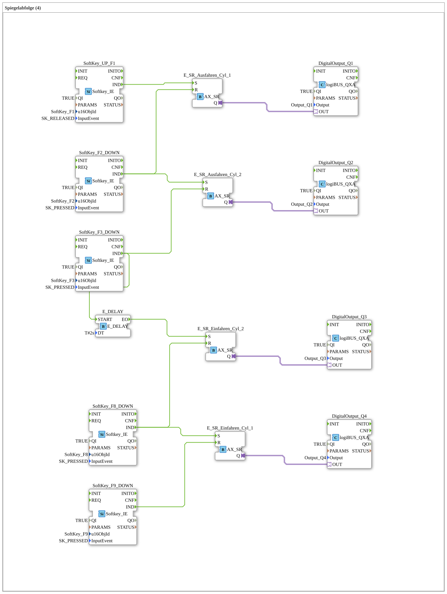

# Uebung_024_AX: Spiegelabfolge (4)

Dieser Artikel beschreibt die 4diac IDE Subapplikation Uebung_024_AX (Spiegelabfolge (4)).

----

## Ziel der Übung

Das Ziel dieser Übung ist die Umsetzung folgender Anforderung: **Spiegelabfolge (4)**

-----

## Beschreibung und Komponenten

Die Übung besteht aus der Subapplikation Uebung_024_AX.SUB, welche die folgende Bausteinstruktur verwendet:

### Verwendete Funktionsbausteine (FBs)

- **DigitalOutput_Q1**: Instanz des Typs logiBUS::io::DQ::logiBUS_QXA.
  - Parameter QI = TRUE
  - Parameter Output = Output_Q1
- **SoftKey_UP_F1**: Instanz des Typs isobus::UT::io::Softkey::Softkey_IE.
  - Parameter QI = TRUE
  - Parameter u16ObjId = SoftKey_F1
  - Parameter InputEvent = SK_RELEASED
- **E_SR_Ausfahren_Cyl_1**: Instanz des Typs adapter::events::unidirectional::AX_SR.
- **SoftKey_F2_DOWN**: Instanz des Typs isobus::UT::io::Softkey::Softkey_IE.
  - Parameter QI = TRUE
  - Parameter u16ObjId = SoftKey_F2
  - Parameter InputEvent = SK_PRESSED
- **DigitalOutput_Q2**: Instanz des Typs logiBUS::io::DQ::logiBUS_QXA.
  - Parameter QI = TRUE
  - Parameter Output = Output_Q2
- **E_SR_Ausfahren_Cyl_2**: Instanz des Typs adapter::events::unidirectional::AX_SR.
- **SoftKey_F3_DOWN**: Instanz des Typs isobus::UT::io::Softkey::Softkey_IE.
  - Parameter QI = TRUE
  - Parameter u16ObjId = SoftKey_F3
  - Parameter InputEvent = SK_PRESSED
- **SoftKey_F9_DOWN**: Instanz des Typs isobus::UT::io::Softkey::Softkey_IE.
  - Parameter QI = TRUE
  - Parameter u16ObjId = SoftKey_F9
  - Parameter InputEvent = SK_PRESSED
- **E_SR_Einfahren_Cyl_2**: Instanz des Typs adapter::events::unidirectional::AX_SR.
- **DigitalOutput_Q3**: Instanz des Typs logiBUS::io::DQ::logiBUS_QXA.
  - Parameter QI = TRUE
  - Parameter Output = Output_Q3
- **DigitalOutput_Q4**: Instanz des Typs logiBUS::io::DQ::logiBUS_QXA.
  - Parameter QI = TRUE
  - Parameter Output = Output_Q4
- **E_SR_Einfahren_Cyl_1**: Instanz des Typs adapter::events::unidirectional::AX_SR.
- **SoftKey_F8_DOWN**: Instanz des Typs isobus::UT::io::Softkey::Softkey_IE.
  - Parameter QI = TRUE
  - Parameter u16ObjId = SoftKey_F8
  - Parameter InputEvent = SK_PRESSED
- **E_DELAY**: Instanz des Typs iec61499::events::E_DELAY.
  - Parameter DT = T#2s

### Verbindungen und Schnittstellen

**Adapterverbindungen:**

- E_SR_Ausfahren_Cyl_1.Q -> DigitalOutput_Q1.OUT
- E_SR_Ausfahren_Cyl_2.Q -> DigitalOutput_Q2.OUT
- E_SR_Einfahren_Cyl_1.Q -> DigitalOutput_Q4.OUT
- E_SR_Einfahren_Cyl_2.Q -> DigitalOutput_Q3.OUT

**Ereignisverbindungen:**

- SoftKey_UP_F1.IND -> E_SR_Ausfahren_Cyl_1.S
- SoftKey_F2_DOWN.IND -> E_SR_Ausfahren_Cyl_1.R
- SoftKey_F2_DOWN.IND -> E_SR_Ausfahren_Cyl_2.S
- SoftKey_F3_DOWN.IND -> E_SR_Ausfahren_Cyl_2.R
- SoftKey_F8_DOWN.IND -> E_SR_Einfahren_Cyl_1.S
- SoftKey_F9_DOWN.IND -> E_SR_Einfahren_Cyl_1.R
- SoftKey_F8_DOWN.IND -> E_SR_Einfahren_Cyl_2.R
- E_DELAY.EO -> E_SR_Einfahren_Cyl_2.S
- SoftKey_F3_DOWN.IND -> E_DELAY.START

### Hinweise aus dem Modell

> START-Knopf Ausfahren
> Endlage Ausfahren_Cyl_1
> Endlage Ausfahren_Cyl_2
> Ausfahren_Cyl_1
> Ausfahren_Cyl_2
> Einfahren Zeit gesteuert
> Endlage Einfahren_Cyl_1
> Einfahren_Cyl_2
> Endlage Einfahren_Cyl_2
> Einfahren_Cyl_1

-----

## Programmablauf und Funktionsweise

1. **Initialisierung**: Beim Systemstart werden alle beteiligten Bausteine initialisiert.
2. **Ereignis- und Signalverarbeitung**: Zustandsänderungen an den Eingängen erzeugen Ereignisse, die über die definierten Verbindungen an die nachgelagerten Bausteine weitergeleitet werden.
3. **Ausgangsaktualisierung**: Die Zielbausteine verarbeiten die empfangenen Signale und aktualisieren entsprechend die Ausgänge.

-----

## Zusammenfassung

Die Übung Uebung_024_AX demonstriert anschaulich die modulare IEC 61499 Architektur in 4diac IDE.
