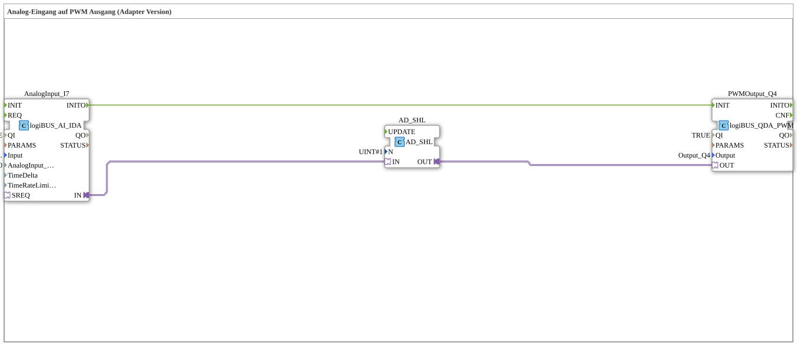

# Uebung_034_AX: Analog-Eingang auf PWM Ausgang (Adapter Version)

Dieser Artikel beschreibt die 4diac IDE Subapplikation Uebung_034_AX (Analog-Eingang auf PWM Ausgang (Adapter Version)).

----

## Ziel der Übung

Das Ziel dieser Übung ist die Umsetzung folgender Anforderung: **Analog-Eingang auf PWM Ausgang (Adapter Version)**

-----

## Beschreibung und Komponenten

Die Übung besteht aus der Subapplikation Uebung_034_AX.SUB, welche die folgende Bausteinstruktur verwendet:

### Verwendete Funktionsbausteine (FBs)

- **AnalogInput_I7**: Instanz des Typs logiBUS::io::AI::logiBUS_AI_IDA.
  - Parameter QI = TRUE
  - Parameter Input = logiBUS_AI::AnalogInput_I7
  - Parameter AnalogInput_hysteresis = 50
- **PWMOutput_Q4**: Instanz des Typs logiBUS::io::DQ::logiBUS_QDA_PWM.
  - Parameter QI = TRUE
  - Parameter Output = Output_Q4
- **AD_SHL**: Instanz des Typs adapter::iec61131::bitwise::AD_SHL.
  - Parameter N = UINT#1

### Verbindungen und Schnittstellen

**Adapterverbindungen:**
- AnalogInput_I7.IN -> AD_SHL.IN
- AD_SHL.OUT -> PWMOutput_Q4.OUT

**Ereignisverbindungen:**
- AnalogInput_I7.INITO -> PWMOutput_Q4.INIT

-----

## Programmablauf und Funktionsweise

1. **Initialisierung**: Beim Systemstart werden alle beteiligten Bausteine initialisiert.
2. **Ereignis- und Signalverarbeitung**: Zustandsänderungen an den Eingängen erzeugen Ereignisse, die über die definierten Verbindungen an die nachgelagerten Bausteine weitergeleitet werden.
3. **Ausgangsaktualisierung**: Die Zielbausteine verarbeiten die empfangenen Signale und aktualisieren entsprechend die Ausgänge.

-----

## Zusammenfassung

Die Übung Uebung_034_AX demonstriert anschaulich die modulare IEC 61499 Architektur in 4diac IDE.
