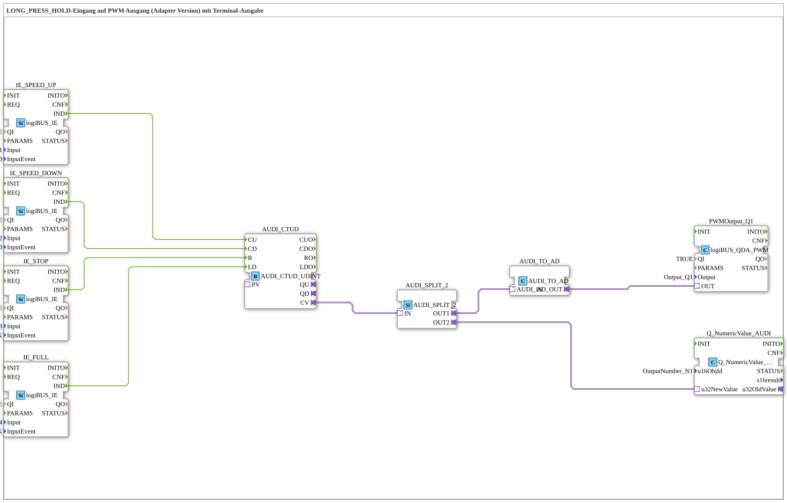

# Uebung_034b_AX: LONG_PRESS_HOLD-Eingang auf PWM Ausgang (Adapter Version) mit Terminal-Ausgabe

Dieser Artikel beschreibt die 4diac IDE Subapplikation Uebung_034b_AX (LONG_PRESS_HOLD-Eingang auf PWM Ausgang (Adapter Version) mit Terminal-Ausgabe).

----

## Ziel der Übung

Das Ziel dieser Übung ist die Umsetzung folgender Anforderung: **LONG_PRESS_HOLD-Eingang auf PWM Ausgang (Adapter Version) mit Terminal-Ausgabe**

-----

## Beschreibung und Komponenten

Die Übung besteht aus der Subapplikation Uebung_034b_AX.SUB, welche die folgende Bausteinstruktur verwendet:

### Verwendete Funktionsbausteine (FBs)

- **PWMOutput_Q1**: Instanz des Typs logiBUS::io::DQ::logiBUS_QDA_PWM.
  - Parameter QI = TRUE
  - Parameter Output = Output_Q1
- **IE_SPEED_UP**: Instanz des Typs logiBUS::io::DI::logiBUS_IE.
  - Parameter QI = TRUE
  - Parameter Input = Input_I1
  - Parameter InputEvent = BUTTON_LONG_PRESS_HOLD
- **IE_SPEED_DOWN**: Instanz des Typs logiBUS::io::DI::logiBUS_IE.
  - Parameter QI = TRUE
  - Parameter Input = Input_I2
  - Parameter InputEvent = BUTTON_LONG_PRESS_HOLD
- **IE_STOP**: Instanz des Typs logiBUS::io::DI::logiBUS_IE.
  - Parameter QI = TRUE
  - Parameter Input = Input_I3
  - Parameter InputEvent = BUTTON_SINGLE_CLICK
- **IE_FULL**: Instanz des Typs logiBUS::io::DI::logiBUS_IE.
  - Parameter QI = TRUE
  - Parameter Input = Input_I4
  - Parameter InputEvent = BUTTON_SINGLE_CLICK
- **AUDI_CTUD**: Instanz des Typs adapter::events::unidirectional::AUDI_CTUD_UDINT.
- **Q_NumericValue_AUDI**: Instanz des Typs isobus::UT::Q::Q_NumericValue_AUDI.
  - Parameter u16ObjId = OutputNumber_N1
- **AUDI_SPLIT_2**: Instanz des Typs adapter::events::unidirectional::AUDI_SPLIT_2.
- **AUDI_TO_AD**: Instanz des Typs adapter::conversion::unidirectional::AUDI_TO_AD.

### Verbindungen und Schnittstellen

**Adapterverbindungen:**
- AUDI_CTUD.CV -> AUDI_SPLIT_2.IN
- AUDI_SPLIT_2.OUT2 -> Q_NumericValue_AUDI.u32NewValue
- AUDI_SPLIT_2.OUT1 -> AUDI_TO_AD.AUDI_IN
- AUDI_TO_AD.AD_OUT -> PWMOutput_Q1.OUT

**Ereignisverbindungen:**
- IE_SPEED_DOWN.IND -> AUDI_CTUD.CD
- IE_STOP.IND -> AUDI_CTUD.R
- IE_FULL.IND -> AUDI_CTUD.LD
- IE_SPEED_UP.IND -> AUDI_CTUD.CU

-----

## Programmablauf und Funktionsweise

1. **Initialisierung**: Beim Systemstart werden alle beteiligten Bausteine initialisiert.
2. **Ereignis- und Signalverarbeitung**: Zustandsänderungen an den Eingängen erzeugen Ereignisse, die über die definierten Verbindungen an die nachgelagerten Bausteine weitergeleitet werden.
3. **Ausgangsaktualisierung**: Die Zielbausteine verarbeiten die empfangenen Signale und aktualisieren entsprechend die Ausgänge.

-----

## Zusammenfassung

Die Übung Uebung_034b_AX demonstriert anschaulich die modulare IEC 61499 Architektur in 4diac IDE.
