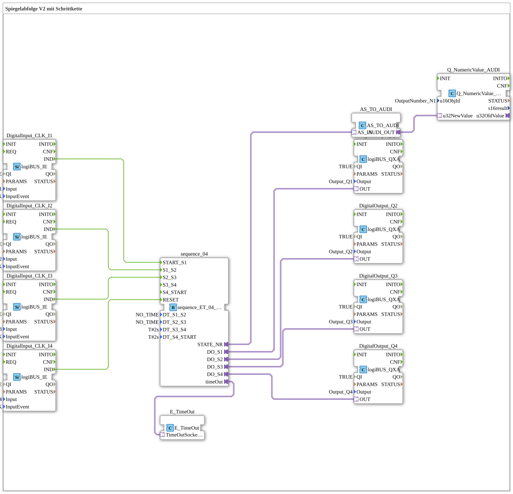

# Uebung_036_AX: Spiegelabfolge V2 mit Schrittkette

Dieser Artikel beschreibt die logiBUS®-Übung `Uebung_036_AX`. Wir bauen eine 4-Kanal-Schrittkette mit AX-Adaptertechnologie, bei der jeder Schritt manuell per Taster ausgelöst wird.

----

## Ziel der Übung

Realisierung einer Abfolge von 4 Ausgängen (`Q1`-`Q4`), bei der jeder Übergang durch einen eigenen Taster (`I1`-`I4`) ausgelöst wird - im Gegensatz zu den zeitgesteuerten Varianten (z. B. `Uebung_037_AX`) läuft hier nichts automatisch weiter.

-----

## Beschreibung und Komponenten

Die Subapplikation `Uebung_036_AX` nutzt den kombinierten Sequenzer `sequence_ET_04_AX`, der sowohl Ereignis- als auch Zeiteingänge besitzt. In dieser Übung sind alle vier Übergänge (`START_S1`, `S1_S2`, `S2_S3`, `RESET`) direkt mit je einem Taster verdrahtet - die Zeitparameter (`DT_S1_S2`/`DT_S2_S3` = `NO_TIME`, `DT_S3_S4`/`DT_S4_START` = `T#2s`) wirken hier nur als Fallback für die letzten beiden Übergänge, die keinen eigenen Taster mehr haben.

- **`sequence_ET_04_AX`**: 4-Schritt-Sequenzer, hier überwiegend ereignisgesteuert genutzt.
- **`Q_NumericValue_AUDI`**: Zeigt die aktuelle Schrittnummer auf dem ISOBUS-Terminal an.

-----

## Funktionsweise

1. Start durch Taster `I1` -> Sequenz springt zu `S1`, `Q1` wird aktiv.
2. Taster `I2` -> Übergang zu `S2`.
3. Taster `I3` -> Übergang zu `S3`.
4. Übergang zu `S4` und zurück zum Start erfolgt automatisch nach `T#2s`, da hierfür kein eigener Taster verdrahtet ist.
5. Reset durch Taster `I4` -> Alles aus.
