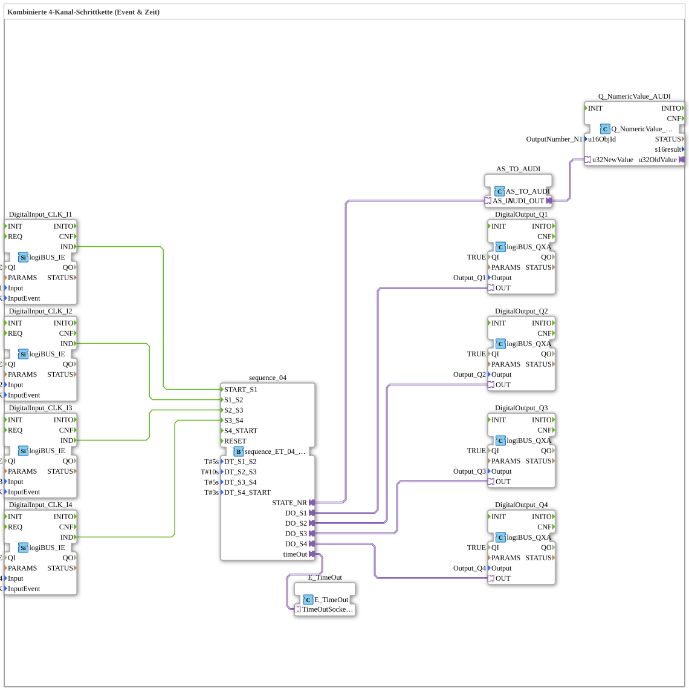

# Uebung_036b_AX: Ablaufsteuerung 4-Kanal (Event & Zeit) (Adapter Version)

Dieser Artikel beschreibt die logiBUS®-Übung `Uebung_036b_AX`. Wir bauen eine kombinierte Event- und Zeit-Schrittkette mit AX-Adaptertechnologie.

----

## Ziel der Übung

Realisierung einer Abfolge von 4 Ausgängen (Q1, Q2, Q3, Q4), gestartet und zurückgesetzt über Ereignisse (Taster), wobei die einzelnen Schritte zusätzlich über feste Zeiten (`DT_Sx_Sy`, je `T#1s`) weitergeschaltet werden - eine Kombination aus Start/Reset per Taster und automatischem Zeittakt zwischen den Schritten.

-----

## Beschreibung und Komponenten

Die Subapplikation `Uebung_036b_AX` nutzt den kombinierten Sequenzer `sequence_ET_04_AX`.

- **`sequence_ET_04_AX`**: Startet auf Ereignis (`I1`), schaltet die 4 Schritte danach zeitgesteuert weiter.
- **`Q_NumericValue_AUDI`**: Zeigt die aktuelle Schrittnummer auf dem ISOBUS-Terminal an.

-----

## Funktionsweise

1. Start durch Taster `I1` -> Sequenz springt zu `S1`.
2. Jeder Ausgang (`Q1, Q2, Q3, Q4`) wird für die eingestellte Zeit aktiv geschaltet, bevor automatisch zum nächsten Schritt gewechselt wird.
3. Nach dem letzten Schritt endet die Sequenz.
4. Reset durch Taster `I4` -> Alles aus.
