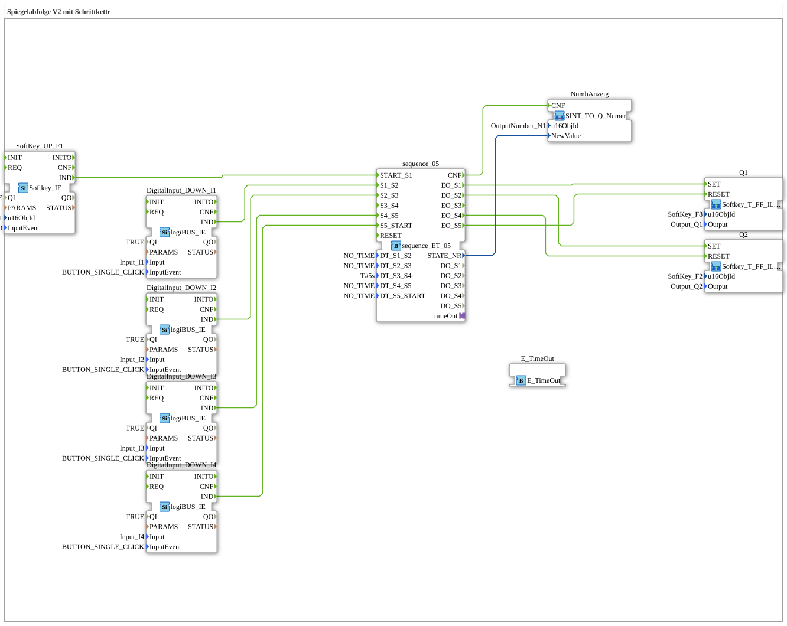

# Uebung_039a_AX: Spiegelabfolge V2 mit Schrittkette

Dieser Artikel beschreibt die 4diac IDE Subapplikation Uebung_039a_AX (Spiegelabfolge V2 mit Schrittkette).

----

## Ziel der Übung

Das Ziel dieser Übung ist die Umsetzung folgender Anforderung: **Spiegelabfolge V2 mit Schrittkette**

-----

## Beschreibung und Komponenten

Die Übung besteht aus der Subapplikation Uebung_039a_AX.SUB, welche die folgende Bausteinstruktur verwendet:

### Verwendete Funktionsbausteine (FBs)

- **E_TimeOut**: Instanz des Typs iec61499::events::E_TimeOut.
- **DigitalInput_DOWN_I1**: Instanz des Typs logiBUS::io::DI::logiBUS_IE.
  - Parameter QI = TRUE
  - Parameter Input = Input_I1
  - Parameter InputEvent = BUTTON_SINGLE_CLICK
- **DigitalInput_DOWN_I2**: Instanz des Typs logiBUS::io::DI::logiBUS_IE.
  - Parameter QI = TRUE
  - Parameter Input = Input_I2
  - Parameter InputEvent = BUTTON_SINGLE_CLICK
- **DigitalInput_DOWN_I3**: Instanz des Typs logiBUS::io::DI::logiBUS_IE.
  - Parameter QI = TRUE
  - Parameter Input = Input_I3
  - Parameter InputEvent = BUTTON_SINGLE_CLICK
- **DigitalInput_DOWN_I4**: Instanz des Typs logiBUS::io::DI::logiBUS_IE.
  - Parameter QI = TRUE
  - Parameter Input = Input_I4
  - Parameter InputEvent = BUTTON_SINGLE_CLICK
- **sequence_05**: Instanz des Typs logiBUS::utils::sequence::combi::sequence_ET_05.
  - Parameter DT_S1_S2 = NO_TIME
  - Parameter DT_S2_S3 = NO_TIME
  - Parameter DT_S3_S4 = T#5s
  - Parameter DT_S4_S5 = NO_TIME
  - Parameter DT_S5_START = NO_TIME
- **SoftKey_UP_F1**: Instanz des Typs isobus::UT::io::Softkey::Softkey_IE.
  - Parameter QI = TRUE
  - Parameter u16ObjId = SoftKey_F1
  - Parameter InputEvent = SK_RELEASED

### Verbindungen und Schnittstellen

**Adapterverbindungen:**
- sequence_05.timeOut -> E_TimeOut.TimeOutSocket

**Ereignisverbindungen:**
- DigitalInput_DOWN_I1.IND -> sequence_05.S1_S2
- DigitalInput_DOWN_I2.IND -> sequence_05.S2_S3
- DigitalInput_DOWN_I3.IND -> sequence_05.S4_S5
- DigitalInput_DOWN_I4.IND -> sequence_05.S5_START
- sequence_05.CNF -> NumbAnzeig.CNF
- SoftKey_UP_F1.IND -> sequence_05.START_S1
- sequence_05.EO_S1 -> Q1.SET
- sequence_05.EO_S2 -> Q2.SET
- sequence_05.EO_S4 -> Q2.RESET
- sequence_05.EO_S5 -> Q1.RESET

**Datenverbindungen:**
- sequence_05.STATE_NR -> NumbAnzeig.NewValue

-----

## Programmablauf und Funktionsweise

1. **Initialisierung**: Beim Systemstart werden alle beteiligten Bausteine initialisiert.
2. **Ereignis- und Signalverarbeitung**: Zustandsänderungen an den Eingängen erzeugen Ereignisse, die über die definierten Verbindungen an die nachgelagerten Bausteine weitergeleitet werden.
3. **Ausgangsaktualisierung**: Die Zielbausteine verarbeiten die empfangenen Signale und aktualisieren entsprechend die Ausgänge.

-----

## Zusammenfassung

Die Übung Uebung_039a_AX demonstriert anschaulich die modulare IEC 61499 Architektur in 4diac IDE.
