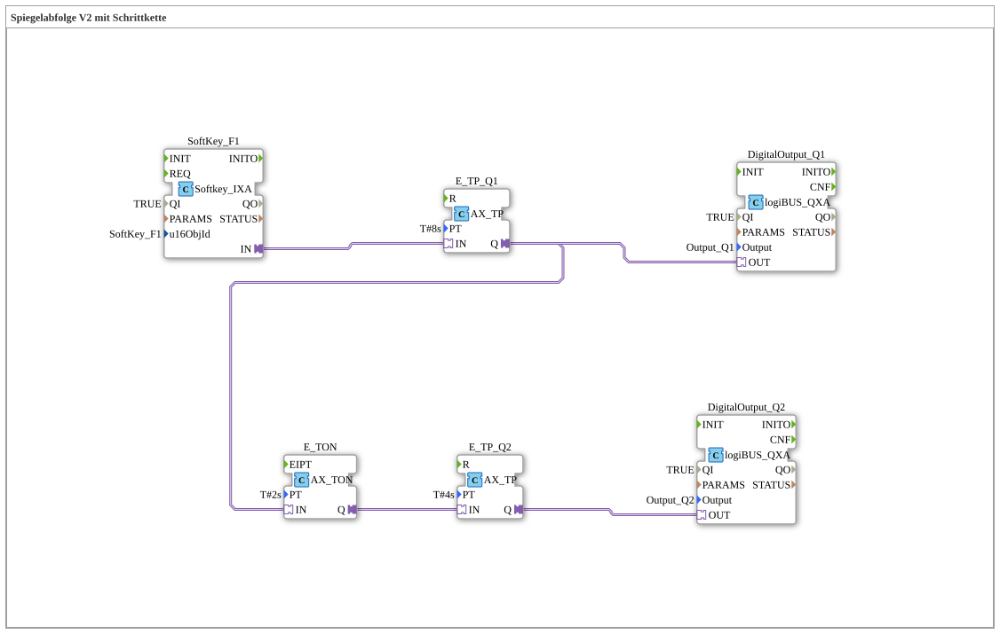

# Uebung_039b_AX: Spiegelabfolge V2 mit Schrittkette

Dieser Artikel beschreibt die 4diac IDE Subapplikation Uebung_039b_AX (Spiegelabfolge V2 mit Schrittkette).

----

## Ziel der Übung

Das Ziel dieser Übung ist die Umsetzung folgender Anforderung: **Spiegelabfolge V2 mit Schrittkette**

-----

## Beschreibung und Komponenten

Die Übung besteht aus der Subapplikation Uebung_039b_AX.SUB, welche die folgende Bausteinstruktur verwendet:

### Verwendete Funktionsbausteine (FBs)

- **DigitalOutput_Q1**: Instanz des Typs logiBUS::io::DQ::logiBUS_QXA.
  - Parameter QI = TRUE
  - Parameter Output = Output_Q1
- **DigitalOutput_Q2**: Instanz des Typs logiBUS::io::DQ::logiBUS_QXA.
  - Parameter QI = TRUE
  - Parameter Output = Output_Q2
- **SoftKey_F1**: Instanz des Typs isobus::UT::io::Softkey::Softkey_IXA.
  - Parameter QI = TRUE
  - Parameter u16ObjId = SoftKey_F1
- **E_TP_Q1**: Instanz des Typs adapter::events::unidirectional::timers::AX_TP.
  - Parameter PT = T#8s
- **E_TP_Q2**: Instanz des Typs adapter::events::unidirectional::timers::AX_TP.
  - Parameter PT = T#4s
- **E_TON**: Instanz des Typs adapter::events::unidirectional::timers::AX_TON.
  - Parameter PT = T#2s

### Verbindungen und Schnittstellen

**Adapterverbindungen:**

- SoftKey_F1.IN -> E_TP_Q1.IN
- E_TON.Q -> E_TP_Q2.IN
- E_TP_Q1.Q -> E_TON.IN
- E_TP_Q1.Q -> DigitalOutput_Q1.OUT
- E_TP_Q2.Q -> DigitalOutput_Q2.OUT

-----

## Programmablauf und Funktionsweise

1. **Initialisierung**: Beim Systemstart werden alle beteiligten Bausteine initialisiert.
2. **Ereignis- und Signalverarbeitung**: Zustandsänderungen an den Eingängen erzeugen Ereignisse, die über die definierten Verbindungen an die nachgelagerten Bausteine weitergeleitet werden.
3. **Ausgangsaktualisierung**: Die Zielbausteine verarbeiten die empfangenen Signale und aktualisieren entsprechend die Ausgänge.

-----

## Zusammenfassung

Die Übung Uebung_039b_AX demonstriert anschaulich die modulare IEC 61499 Architektur in 4diac IDE.
