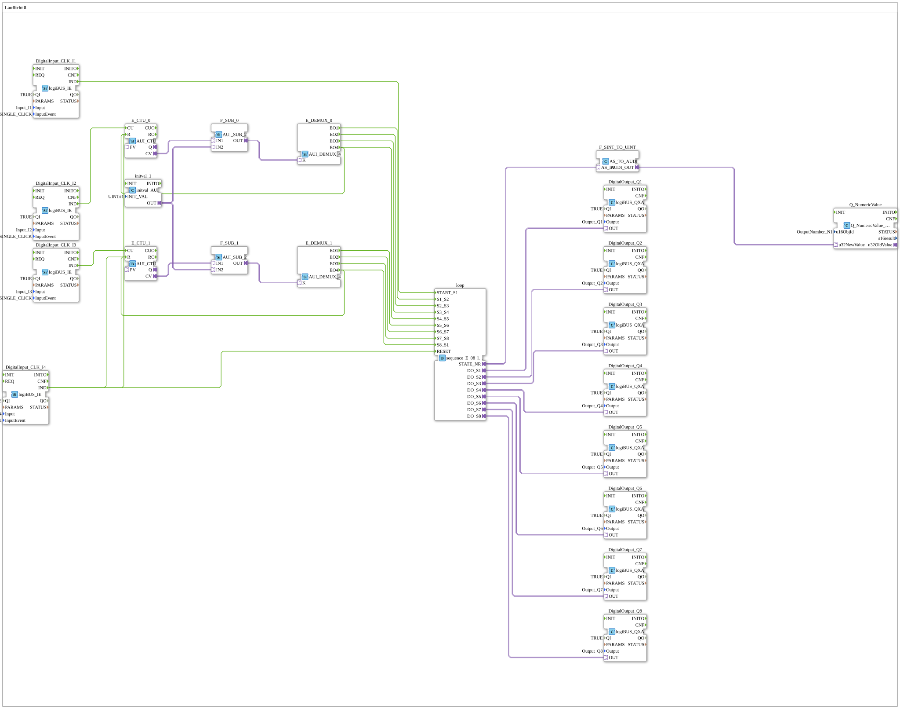

# Uebung_040_2_AX: Lauflicht 8

Dieser Artikel beschreibt die 4diac IDE Subapplikation Uebung_040_2_AX (Lauflicht 8).

----

## Ziel der Übung

Das Ziel dieser Übung ist die Umsetzung folgender Anforderung: **Lauflicht 8**

-----

## Beschreibung und Komponenten

Die Übung besteht aus der Subapplikation Uebung_040_2_AX.SUB, welche die folgende Bausteinstruktur verwendet:

### Verwendete Funktionsbausteine (FBs)

- **DigitalOutput_Q1**: Instanz des Typs logiBUS::io::DQ::logiBUS_QXA.
  - Parameter QI = TRUE
  - Parameter Output = Output_Q1
- **DigitalOutput_Q2**: Instanz des Typs logiBUS::io::DQ::logiBUS_QXA.
  - Parameter QI = TRUE
  - Parameter Output = Output_Q2
- **DigitalOutput_Q3**: Instanz des Typs logiBUS::io::DQ::logiBUS_QXA.
  - Parameter QI = TRUE
  - Parameter Output = Output_Q3
- **DigitalOutput_Q4**: Instanz des Typs logiBUS::io::DQ::logiBUS_QXA.
  - Parameter QI = TRUE
  - Parameter Output = Output_Q4
- **DigitalInput_CLK_I1**: Instanz des Typs logiBUS::io::DI::logiBUS_IE.
  - Parameter QI = TRUE
  - Parameter Input = Input_I1
  - Parameter InputEvent = BUTTON_SINGLE_CLICK
- **DigitalInput_CLK_I4**: Instanz des Typs logiBUS::io::DI::logiBUS_IE.
  - Parameter QI = TRUE
  - Parameter Input = Input_I4
  - Parameter InputEvent = BUTTON_SINGLE_CLICK
- **DigitalOutput_Q5**: Instanz des Typs logiBUS::io::DQ::logiBUS_QXA.
  - Parameter QI = TRUE
  - Parameter Output = Output_Q5
- **DigitalOutput_Q6**: Instanz des Typs logiBUS::io::DQ::logiBUS_QXA.
  - Parameter QI = TRUE
  - Parameter Output = Output_Q6
- **DigitalOutput_Q7**: Instanz des Typs logiBUS::io::DQ::logiBUS_QXA.
  - Parameter QI = TRUE
  - Parameter Output = Output_Q7
- **DigitalOutput_Q8**: Instanz des Typs logiBUS::io::DQ::logiBUS_QXA.
  - Parameter QI = TRUE
  - Parameter Output = Output_Q8
- **Q_NumericValue**: Instanz des Typs isobus::UT::Q::Q_NumericValue_AUDI.
  - Parameter u16ObjId = OutputNumber_N1
- **F_SINT_TO_UINT**: Instanz des Typs adapter::conversion::unidirectional::AS_TO_AUDI.
- **loop**: Instanz des Typs logiBUS::utils::sequence::event::sequence_E_08_loop_AX.
- **E_CTU_0**: Instanz des Typs adapter::events::unidirectional::AUI_CTU.
- **F_SUB_0**: Instanz des Typs adapter::iec61131::arithmetic::AUI_SUB_2.
- **E_DEMUX_0**: Instanz des Typs adapter::events::unidirectional::AUI_DEMUX_4.
- **DigitalInput_CLK_I2**: Instanz des Typs logiBUS::io::DI::logiBUS_IE.
  - Parameter QI = TRUE
  - Parameter Input = Input_I2
  - Parameter InputEvent = BUTTON_SINGLE_CLICK
- **E_CTU_1**: Instanz des Typs adapter::events::unidirectional::AUI_CTU.
- **F_SUB_1**: Instanz des Typs adapter::iec61131::arithmetic::AUI_SUB_2.
- **E_DEMUX_1**: Instanz des Typs adapter::events::unidirectional::AUI_DEMUX_4.
- **DigitalInput_CLK_I3**: Instanz des Typs logiBUS::io::DI::logiBUS_IE.
  - Parameter QI = TRUE
  - Parameter Input = Input_I3
  - Parameter InputEvent = BUTTON_SINGLE_CLICK
- **initval_1**: Instanz des Typs adapter::types::unidirectional::AUI::initval::initval_AUI.
  - Parameter INIT_VAL = 1

### Verbindungen und Schnittstellen

**Adapterverbindungen:**
- loop.DO_S1 -> DigitalOutput_Q1.OUT
- loop.DO_S2 -> DigitalOutput_Q2.OUT
- loop.DO_S3 -> DigitalOutput_Q3.OUT
- loop.DO_S4 -> DigitalOutput_Q4.OUT
- loop.DO_S5 -> DigitalOutput_Q5.OUT
- loop.DO_S6 -> DigitalOutput_Q6.OUT
- loop.DO_S7 -> DigitalOutput_Q7.OUT
- loop.DO_S8 -> DigitalOutput_Q8.OUT
- loop.STATE_NR -> F_SINT_TO_UINT.AS_IN
- F_SINT_TO_UINT.AUDI_OUT -> Q_NumericValue.u32NewValue
- E_CTU_0.CV -> F_SUB_0.IN1
- initval_1.OUT -> F_SUB_0.IN2
- F_SUB_0.OUT -> E_DEMUX_0.K
- E_CTU_1.CV -> F_SUB_1.IN1
- initval_1.OUT -> F_SUB_1.IN2
- F_SUB_1.OUT -> E_DEMUX_1.K

**Ereignisverbindungen:**
- DigitalInput_CLK_I4.IND -> loop.RESET
- DigitalInput_CLK_I1.IND -> loop.START_S1
- E_DEMUX_0.EO1 -> loop.S1_S2
- E_DEMUX_0.EO2 -> loop.S2_S3
- E_DEMUX_0.EO3 -> loop.S3_S4
- E_DEMUX_0.EO4 -> loop.S4_S5
- DigitalInput_CLK_I2.IND -> E_CTU_0.CU
- DigitalInput_CLK_I3.IND -> E_CTU_1.CU
- E_DEMUX_1.EO4 -> loop.S8_S1
- E_DEMUX_1.EO3 -> loop.S7_S8
- E_DEMUX_1.EO2 -> loop.S6_S7
- E_DEMUX_1.EO1 -> loop.S5_S6
- DigitalInput_CLK_I4.IND -> E_CTU_1.R
- DigitalInput_CLK_I4.IND -> E_CTU_0.R
- E_DEMUX_0.EO4 -> E_CTU_0.R
- E_DEMUX_1.EO4 -> E_CTU_1.R

-----

## Programmablauf und Funktionsweise

1. **Initialisierung**: Beim Systemstart werden alle beteiligten Bausteine initialisiert.
2. **Ereignis- und Signalverarbeitung**: Zustandsänderungen an den Eingängen erzeugen Ereignisse, die über die definierten Verbindungen an die nachgelagerten Bausteine weitergeleitet werden.
3. **Ausgangsaktualisierung**: Die Zielbausteine verarbeiten die empfangenen Signale und aktualisieren entsprechend die Ausgänge.

-----

## Zusammenfassung

Die Übung Uebung_040_2_AX demonstriert anschaulich die modulare IEC 61499 Architektur in 4diac IDE.
