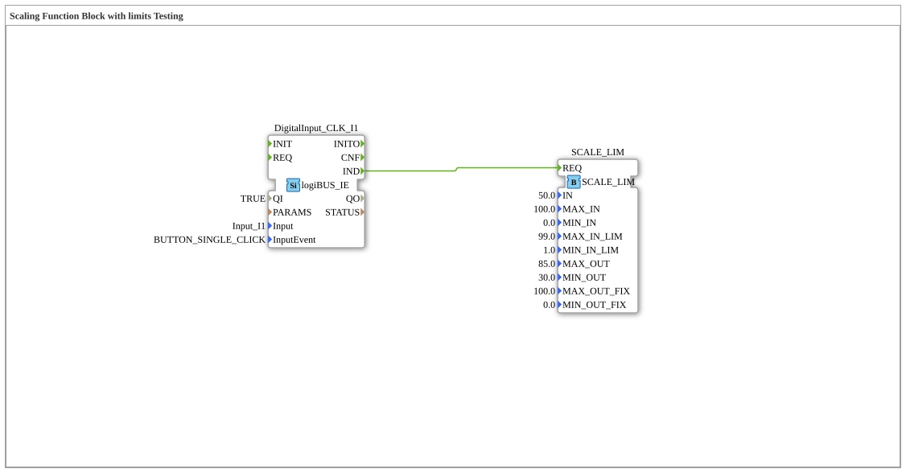

# Uebung_043_AX: Scaling Function Block with limits Testing

Dieser Artikel beschreibt die 4diac IDE Subapplikation Uebung_043_AX (Scaling Function Block with limits Testing).

----

## Ziel der Übung

Das Ziel dieser Übung ist die Umsetzung folgender Anforderung: **Scaling Function Block with limits Testing**

-----

## Beschreibung und Komponenten

Die Übung besteht aus der Subapplikation Uebung_043_AX.SUB, welche die folgende Bausteinstruktur verwendet:

### Verwendete Funktionsbausteine (FBs)

- **DigitalInput_CLK_I1**: Instanz des Typs logiBUS::io::DI::logiBUS_IE.
  - Parameter QI = TRUE
  - Parameter Input = Input_I1
  - Parameter InputEvent = BUTTON_SINGLE_CLICK
- **SCALE_LIM**: Instanz des Typs eclipse4diac::signalprocessing::SCALE_LIM.
  - Parameter IN = 50.0
  - Parameter MAX_IN = 100.0
  - Parameter MIN_IN = 0.0
  - Parameter MAX_IN_LIM = 99.0
  - Parameter MIN_IN_LIM = 1.0
  - Parameter MAX_OUT = 85.0
  - Parameter MIN_OUT = 30.0
  - Parameter MAX_OUT_FIX = 100.0
  - Parameter MIN_OUT_FIX = 0.0

### Verbindungen und Schnittstellen

**Ereignisverbindungen:**
- DigitalInput_CLK_I1.IND -> SCALE_LIM.REQ

-----

## Programmablauf und Funktionsweise

1. **Initialisierung**: Beim Systemstart werden alle beteiligten Bausteine initialisiert.
2. **Ereignis- und Signalverarbeitung**: Zustandsänderungen an den Eingängen erzeugen Ereignisse, die über die definierten Verbindungen an die nachgelagerten Bausteine weitergeleitet werden.
3. **Ausgangsaktualisierung**: Die Zielbausteine verarbeiten die empfangenen Signale und aktualisieren entsprechend die Ausgänge.

-----

## Zusammenfassung

Die Übung Uebung_043_AX demonstriert anschaulich die modulare IEC 61499 Architektur in 4diac IDE.
