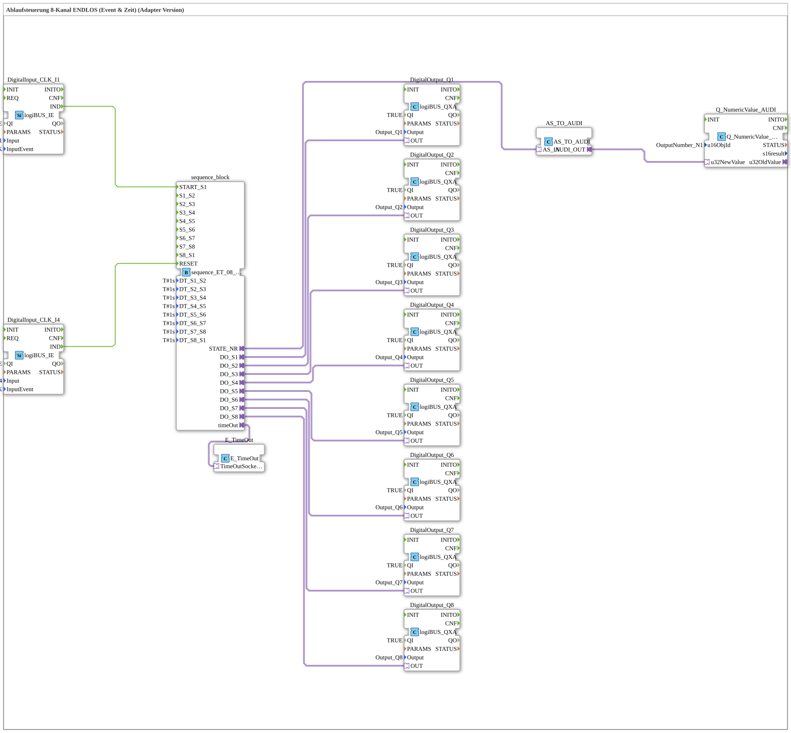

# Uebung_046_AX: Ablaufsteuerung 8-Kanal (Event & Zeit) ENDLOS (Adapter Version)

Dieser Artikel beschreibt die logiBUS®-Übung `Uebung_046_AX`. Wir bauen eine kombinierte Event- und Zeit-Schrittkette mit AX-Adaptertechnologie.

----

## Ziel der Übung

Realisierung einer Abfolge von 8 Ausgängen (Q1, Q2, Q3, Q4, Q5, Q6, Q7, Q8), gestartet und zurückgesetzt über Ereignisse (Taster), wobei die einzelnen Schritte zusätzlich über feste Zeiten (`DT_Sx_Sy`, je `T#1s`) weitergeschaltet werden - eine Kombination aus Start/Reset per Taster und automatischem Zeittakt zwischen den Schritten.

-----

## Beschreibung und Komponenten

Die Subapplikation `Uebung_046_AX` nutzt den kombinierten Sequenzer `sequence_ET_08_loop_AX`.

- **`sequence_ET_08_loop_AX`**: Startet auf Ereignis (`I1`), schaltet die 8 Schritte danach zeitgesteuert weiter.
- **`Q_NumericValue_AUDI`**: Zeigt die aktuelle Schrittnummer auf dem ISOBUS-Terminal an.

-----

## Funktionsweise

1. Start durch Taster `I1` -> Sequenz springt zu `S1`.
2. Jeder Ausgang (`Q1, Q2, Q3, Q4, Q5, Q6, Q7, Q8`) wird für die eingestellte Zeit aktiv geschaltet, bevor automatisch zum nächsten Schritt gewechselt wird.
3. Nach dem letzten Schritt kehrt die Sequenz automatisch zu S1 zurück (ENDLOS).
4. Reset durch Taster `I4` -> Alles aus.
