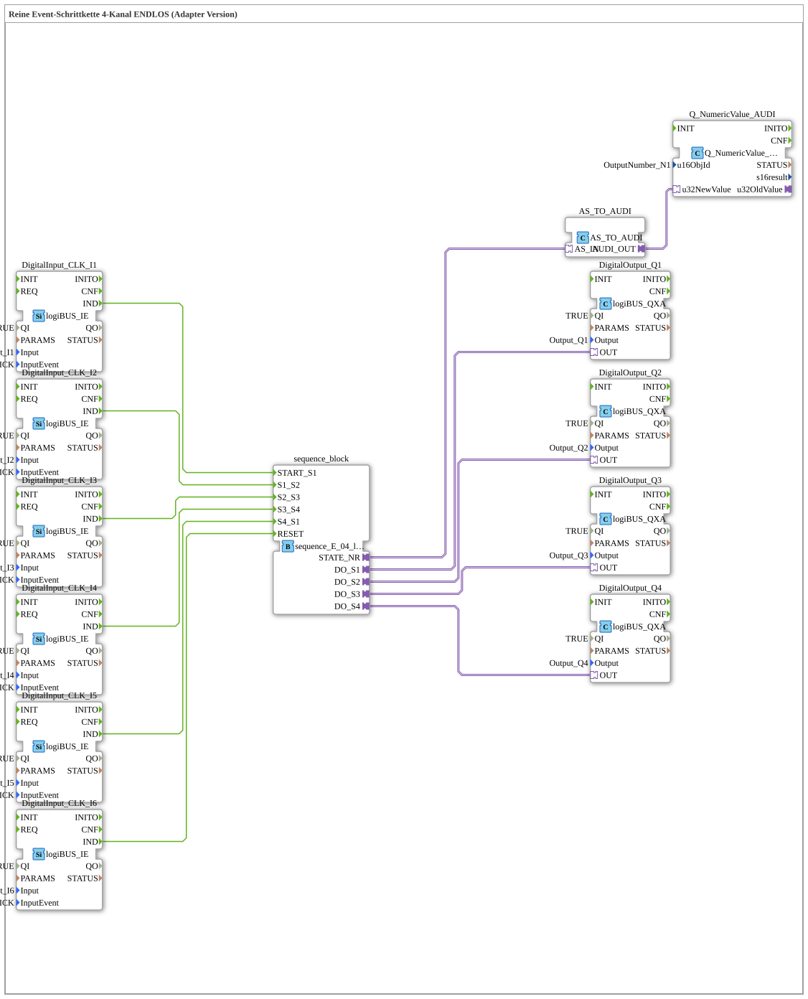

# Uebung_048_AX: Reine Event-Schrittkette 4-Kanal ENDLOS (Adapter Version)

Dieser Artikel beschreibt die logiBUS®-Übung `Uebung_048_AX`. Wir bauen eine rein ereignisgesteuerte Schrittkette mit AX-Adaptertechnologie.

----

## Ziel der Übung

Realisierung einer Abfolge von 4 Ausgängen (Q1, Q2, Q3, Q4), bei der jeder Schritt ausschließlich durch ein externes Ereignis (Tasterdruck) weitergeschaltet wird - keine automatische Zeitsteuerung.

-----

## Beschreibung und Komponenten

Die Subapplikation `Uebung_048_AX` nutzt den Sequenzer `sequence_E_04_loop_AX`, der 4 Zustände rein ereignisgesteuert durchläuft.

Jeder Übergang zwischen den Schritten wird durch eine eigene Tasterbetätigung (`I1` bis `I6`) ausgelöst - die Sequenz wartet an jedem Schritt, bis der nächste Taster gedrückt wird.

- **`Q_NumericValue_AUDI`**: Zeigt die aktuelle Schrittnummer auf dem ISOBUS-Terminal an.

-----

## Funktionsweise

1. Start durch Taster `I1` -> Sequenz springt zu `S1`, Ausgang `Q1` wird aktiv.
2. Jeder weitere Tasterdruck schaltet zum nächsten Schritt weiter.
3. Nach dem letzten Schritt kehrt die Sequenz automatisch zu S1 zurück (ENDLOS).
4. Reset durch den letzten Taster -> Alles aus.
