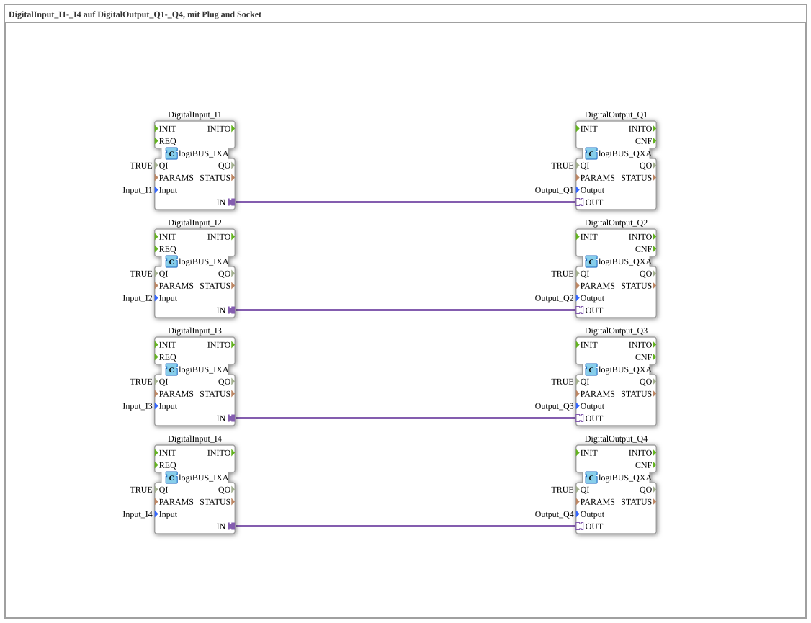

# Uebung_049_AX: DigitalInput_I1-_I4 auf DigitalOutput_Q1-_Q4, mit Plug and Socket

Dieser Artikel beschreibt die 4diac IDE Subapplikation Uebung_049_AX (DigitalInput_I1-_I4 auf DigitalOutput_Q1-_Q4, mit Plug and Socket).

----

## Ziel der Übung

Das Ziel dieser Übung ist die Umsetzung folgender Anforderung: **DigitalInput_I1-_I4 auf DigitalOutput_Q1-_Q4, mit Plug and Socket**

-----

## Beschreibung und Komponenten

Die Übung besteht aus der Subapplikation Uebung_049_AX.SUB, welche die folgende Bausteinstruktur verwendet:

### Verwendete Funktionsbausteine (FBs)

- **DigitalOutput_Q1**: Instanz des Typs logiBUS::io::DQ::logiBUS_QXA.
  - Parameter QI = TRUE
  - Parameter Output = Output_Q1
- **DigitalInput_I1**: Instanz des Typs logiBUS::io::DI::logiBUS_IXA.
  - Parameter QI = TRUE
  - Parameter Input = Input_I1
- **DigitalOutput_Q2**: Instanz des Typs logiBUS::io::DQ::logiBUS_QXA.
  - Parameter QI = TRUE
  - Parameter Output = Output_Q2
- **DigitalInput_I2**: Instanz des Typs logiBUS::io::DI::logiBUS_IXA.
  - Parameter QI = TRUE
  - Parameter Input = Input_I2
- **DigitalOutput_Q3**: Instanz des Typs logiBUS::io::DQ::logiBUS_QXA.
  - Parameter QI = TRUE
  - Parameter Output = Output_Q3
- **DigitalInput_I3**: Instanz des Typs logiBUS::io::DI::logiBUS_IXA.
  - Parameter QI = TRUE
  - Parameter Input = Input_I3
- **DigitalOutput_Q4**: Instanz des Typs logiBUS::io::DQ::logiBUS_QXA.
  - Parameter QI = TRUE
  - Parameter Output = Output_Q4
- **DigitalInput_I4**: Instanz des Typs logiBUS::io::DI::logiBUS_IXA.
  - Parameter QI = TRUE
  - Parameter Input = Input_I4

### Verbindungen und Schnittstellen

**Adapterverbindungen:**

- DigitalInput_I1.IN -> DigitalOutput_Q1.OUT
- DigitalInput_I2.IN -> DigitalOutput_Q2.OUT
- DigitalInput_I3.IN -> DigitalOutput_Q3.OUT
- DigitalInput_I4.IN -> DigitalOutput_Q4.OUT

-----

## Programmablauf und Funktionsweise

1. **Initialisierung**: Beim Systemstart werden alle beteiligten Bausteine initialisiert.
2. **Ereignis- und Signalverarbeitung**: Zustandsänderungen an den Eingängen erzeugen Ereignisse, die über die definierten Verbindungen an die nachgelagerten Bausteine weitergeleitet werden.
3. **Ausgangsaktualisierung**: Die Zielbausteine verarbeiten die empfangenen Signale und aktualisieren entsprechend die Ausgänge.

-----

## Zusammenfassung

Die Übung Uebung_049_AX demonstriert anschaulich die modulare IEC 61499 Architektur in 4diac IDE.
