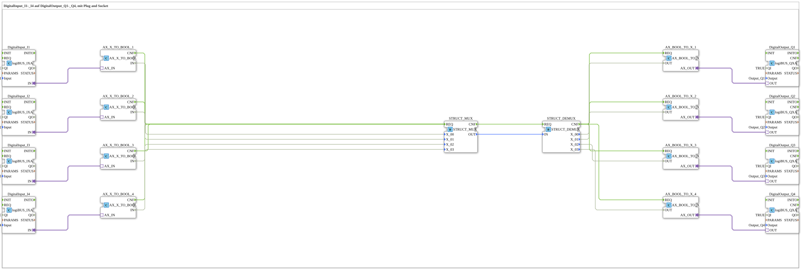

# Uebung_051_AX: DigitalInput_I1-_I4 auf DigitalOutput_Q1-_Q4, mit Plug and Socket

Dieser Artikel beschreibt die 4diac IDE Subapplikation Uebung_051_AX (DigitalInput_I1-_I4 auf DigitalOutput_Q1-_Q4, mit Plug and Socket).

----

## Ziel der Übung

Das Ziel dieser Übung ist die Umsetzung folgender Anforderung: **DigitalInput_I1-_I4 auf DigitalOutput_Q1-_Q4, mit Plug and Socket**

-----

## Beschreibung und Komponenten

Die Übung besteht aus der Subapplikation Uebung_051_AX.SUB, welche die folgende Bausteinstruktur verwendet:

### Verwendete Funktionsbausteine (FBs)

- **DigitalOutput_Q1**: Instanz des Typs logiBUS::io::DQ::logiBUS_QXA.
  - Parameter QI = TRUE
  - Parameter Output = Output_Q1
- **DigitalInput_I1**: Instanz des Typs logiBUS::io::DI::logiBUS_IXA.
  - Parameter QI = TRUE
  - Parameter Input = Input_I1
- **DigitalOutput_Q2**: Instanz des Typs logiBUS::io::DQ::logiBUS_QXA.
  - Parameter QI = TRUE
  - Parameter Output = Output_Q2
- **DigitalInput_I2**: Instanz des Typs logiBUS::io::DI::logiBUS_IXA.
  - Parameter QI = TRUE
  - Parameter Input = Input_I2
- **DigitalOutput_Q3**: Instanz des Typs logiBUS::io::DQ::logiBUS_QXA.
  - Parameter QI = TRUE
  - Parameter Output = Output_Q3
- **DigitalInput_I3**: Instanz des Typs logiBUS::io::DI::logiBUS_IXA.
  - Parameter QI = TRUE
  - Parameter Input = Input_I3
- **DigitalOutput_Q4**: Instanz des Typs logiBUS::io::DQ::logiBUS_QXA.
  - Parameter QI = TRUE
  - Parameter Output = Output_Q4
- **DigitalInput_I4**: Instanz des Typs logiBUS::io::DI::logiBUS_IXA.
  - Parameter QI = TRUE
  - Parameter Input = Input_I4
- **STRUCT_DEMUX**: Instanz des Typs eclipse4diac::convert::STRUCT_DEMUX.
- **STRUCT_MUX**: Instanz des Typs eclipse4diac::convert::STRUCT_MUX.
- **AX_X_TO_BOOL_1**: Instanz des Typs adapter::conversion::unidirectional::AX_X_TO_BOOL.
- **AX_X_TO_BOOL_2**: Instanz des Typs adapter::conversion::unidirectional::AX_X_TO_BOOL.
- **AX_X_TO_BOOL_3**: Instanz des Typs adapter::conversion::unidirectional::AX_X_TO_BOOL.
- **AX_X_TO_BOOL_4**: Instanz des Typs adapter::conversion::unidirectional::AX_X_TO_BOOL.
- **AX_BOOL_TO_X_1**: Instanz des Typs adapter::conversion::unidirectional::AX_BOOL_TO_X.
- **AX_BOOL_TO_X_2**: Instanz des Typs adapter::conversion::unidirectional::AX_BOOL_TO_X.
- **AX_BOOL_TO_X_3**: Instanz des Typs adapter::conversion::unidirectional::AX_BOOL_TO_X.
- **AX_BOOL_TO_X_4**: Instanz des Typs adapter::conversion::unidirectional::AX_BOOL_TO_X.

### Verbindungen und Schnittstellen

**Adapterverbindungen:**

- DigitalInput_I1.IN -> AX_X_TO_BOOL_1.AX_IN
- DigitalInput_I2.IN -> AX_X_TO_BOOL_2.AX_IN
- DigitalInput_I3.IN -> AX_X_TO_BOOL_3.AX_IN
- DigitalInput_I4.IN -> AX_X_TO_BOOL_4.AX_IN
- AX_BOOL_TO_X_1.AX_OUT -> DigitalOutput_Q1.OUT
- AX_BOOL_TO_X_2.AX_OUT -> DigitalOutput_Q2.OUT
- AX_BOOL_TO_X_3.AX_OUT -> DigitalOutput_Q3.OUT
- AX_BOOL_TO_X_4.AX_OUT -> DigitalOutput_Q4.OUT

**Ereignisverbindungen:**

- AX_X_TO_BOOL_1.CNF -> STRUCT_MUX.REQ
- AX_X_TO_BOOL_2.CNF -> STRUCT_MUX.REQ
- AX_X_TO_BOOL_3.CNF -> STRUCT_MUX.REQ
- AX_X_TO_BOOL_4.CNF -> STRUCT_MUX.REQ
- STRUCT_MUX.CNF -> STRUCT_DEMUX.REQ
- STRUCT_DEMUX.CNF -> AX_BOOL_TO_X_1.REQ
- STRUCT_DEMUX.CNF -> AX_BOOL_TO_X_2.REQ
- STRUCT_DEMUX.CNF -> AX_BOOL_TO_X_3.REQ
- STRUCT_DEMUX.CNF -> AX_BOOL_TO_X_4.REQ

**Datenverbindungen:**

- AX_X_TO_BOOL_1.IN -> STRUCT_MUX.X_00
- AX_X_TO_BOOL_2.IN -> STRUCT_MUX.X_01
- AX_X_TO_BOOL_3.IN -> STRUCT_MUX.X_02
- AX_X_TO_BOOL_4.IN -> STRUCT_MUX.X_03
- STRUCT_MUX.OUT -> STRUCT_DEMUX.IN
- STRUCT_DEMUX.X_00 -> AX_BOOL_TO_X_1.OUT
- STRUCT_DEMUX.X_01 -> AX_BOOL_TO_X_2.OUT
- STRUCT_DEMUX.X_02 -> AX_BOOL_TO_X_3.OUT
- STRUCT_DEMUX.X_03 -> AX_BOOL_TO_X_4.OUT

-----

## Programmablauf und Funktionsweise

1. **Initialisierung**: Beim Systemstart werden alle beteiligten Bausteine initialisiert.
2. **Ereignis- und Signalverarbeitung**: Zustandsänderungen an den Eingängen erzeugen Ereignisse, die über die definierten Verbindungen an die nachgelagerten Bausteine weitergeleitet werden.
3. **Ausgangsaktualisierung**: Die Zielbausteine verarbeiten die empfangenen Signale und aktualisieren entsprechend die Ausgänge.

-----

## Zusammenfassung

Die Übung Uebung_051_AX demonstriert anschaulich die modulare IEC 61499 Architektur in 4diac IDE.
