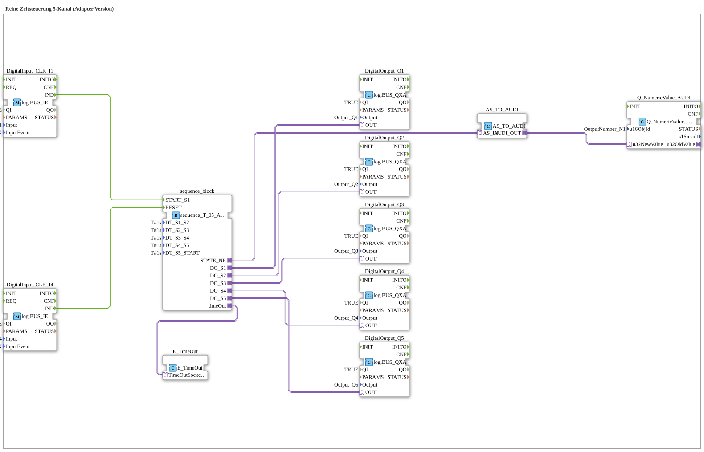

# Uebung_062_AX: Reine Zeitsteuerung 5-Kanal (Adapter Version)

Dieser Artikel beschreibt die logiBUS®-Übung `Uebung_062_AX`. Wir bauen eine rein zeitgesteuerte Schrittkette mit AX-Adaptertechnologie.

----

## Ziel der Übung

Realisierung einer automatischen Abfolge von 5 Ausgängen (Q1, Q2, Q3, Q4, Q5), bei der jeder Schritt ausschließlich nach Ablauf einer festen Wartezeit (`DT_S1_S2` usw., je `T#1s`) zum nächsten wechselt - ganz ohne weitere Tasterbetätigung während des Ablaufs.

-----

## Beschreibung und Komponenten

Die Subapplikation `Uebung_062_AX` nutzt den Sequenzer `sequence_T_05_AX` (AX-Adaptervariante), der 5 Zustände (`S1` bis `S5`) rein zeitgesteuert durchläuft.

- **`sequence_T_05_AX`**: Verwaltet die 5 Schritte, jeder Übergang erfolgt nach Ablauf der jeweiligen `DT_Sx_Sy`-Parameter.
- **`E_TimeOut`**: Überwacht die Sequenz als Watchdog.
- **`Q_NumericValue_AUDI`**: Zeigt die aktuelle Schrittnummer auf dem ISOBUS-Terminal an.

-----

## Funktionsweise

1. Start durch Taster `I1` -> Sequenz springt zu `S1`.
2. Jeder Ausgang (`Q1, Q2, Q3, Q4, Q5`) wird für die eingestellte Zeit aktiv geschaltet, bevor automatisch zum nächsten Schritt gewechselt wird.
3. Nach dem letzten Schritt endet die Sequenz.
4. Reset durch Taster `I4` -> Alles aus, Sequenz zurück in den Grundzustand.
