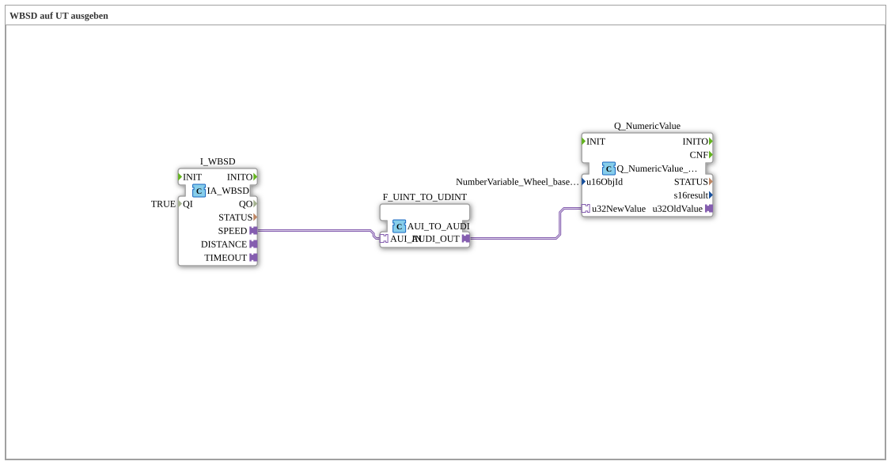

# Uebung_070_AX: WBSD auf UT ausgeben

Dieser Artikel beschreibt die 4diac IDE Subapplikation Uebung_070_AX (WBSD auf UT ausgeben).

----

## Ziel der Übung

Das Ziel dieser Übung ist die Umsetzung folgender Anforderung: **WBSD auf UT ausgeben**

-----

## Beschreibung und Komponenten

Die Übung besteht aus der Subapplikation Uebung_070_AX.SUB, welche die folgende Bausteinstruktur verwendet:

### Verwendete Funktionsbausteine (FBs)

- **I_WBSD**: Instanz des Typs isobus::tecu::IA_WBSD.
  - Parameter QI = TRUE
- **Q_NumericValue**: Instanz des Typs isobus::UT::Q::Q_NumericValue_AUDI.
  - Parameter u16ObjId = NumberVariable_Wheel_based_machine_speed
- **F_UINT_TO_UDINT**: Instanz des Typs adapter::conversion::unidirectional::AUI_TO_AUDI.

### Verbindungen und Schnittstellen

**Adapterverbindungen:**

- I_WBSD.SPEED -> F_UINT_TO_UDINT.AUI_IN
- F_UINT_TO_UDINT.AUDI_OUT -> Q_NumericValue.u32NewValue

-----

## Programmablauf und Funktionsweise

1. **Initialisierung**: Beim Systemstart werden alle beteiligten Bausteine initialisiert.
2. **Ereignis- und Signalverarbeitung**: Zustandsänderungen an den Eingängen erzeugen Ereignisse, die über die definierten Verbindungen an die nachgelagerten Bausteine weitergeleitet werden.
3. **Ausgangsaktualisierung**: Die Zielbausteine verarbeiten die empfangenen Signale und aktualisieren entsprechend die Ausgänge.

-----

## Zusammenfassung

Die Übung Uebung_070_AX demonstriert anschaulich die modulare IEC 61499 Architektur in 4diac IDE.
