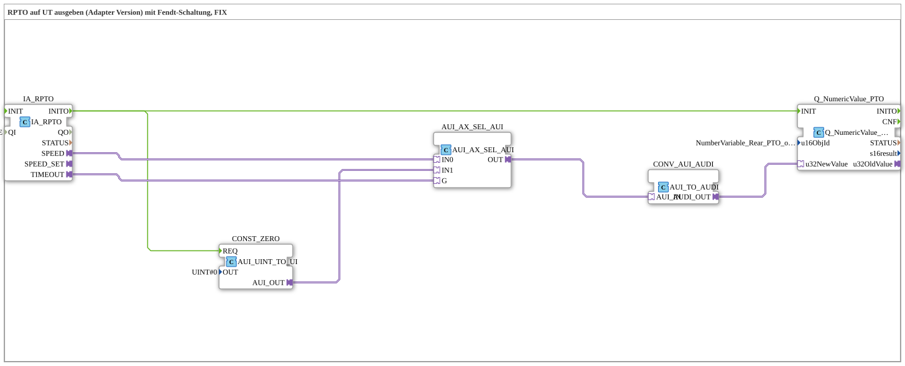

# Uebung_074a_AUI: RPTO auf UT ausgeben (Adapter Version) mit Fendt-Schaltung, FIX

Dieser Artikel beschreibt die logiBUS®-Übung `Uebung_074a_AUI`. Wir lesen die ISOBUS-TECU-Drehzahl der rückwärtigen Zapfwelle (RPTO) und geben sie am ISOBUS-Terminal aus, mit einer zusätzlichen Fendt-spezifischen Auswahlschaltung.

----

## Ziel der Übung

Anzeige der Zapfwellendrehzahl (`Rear PTO output shaft speed`) auf dem VT-Terminal, wobei zwischen dem realen TECU-Wert und einem festen Ersatzwert (`FIX`) umgeschaltet werden kann - relevant für Fendt-Traktoren, bei denen das TECU-Signal unter bestimmten Bedingungen nicht zuverlässig ist.

-----

## Beschreibung und Komponenten

- **`IA_RPTO`**: `isobus::tecu::IA_RPTO`, liest die Zapfwellendrehzahl vom Tractor-ECU (TECU) über ISOBUS.
- **`AUI_AX_SEL_AUI`**: `adapter::iec61131::selection::AUI_AX_SEL_AUI`, wählt zwischen dem realen TECU-Wert (`IN0`) und einem festen Ersatzwert `UINT#0` (`IN1`) - gesteuert (`G`) über das Timeout-Signal von `IA_RPTO`.
- **`CONST_ZERO`**: `adapter::conversion::unidirectional::AUI_UINT_TO_UI`, stellt den festen Ersatzwert `UINT#0` als AUI-Adapterwert bereit.
- **`CONV_AUI_AUDI`**: `adapter::conversion::unidirectional::AUI_TO_AUDI`, wandelt den ausgewählten AUI-Wert in das für `Q_NumericValue` benötigte AUDI-Format um.
- **`Q_NumericValue_PTO`**: zeigt den Wert auf dem VT-Terminal an (`u16ObjId = NumberVariable_Rear_PTO_output_shaft_speed`).

-----

## Funktionsweise

1. `IA_RPTO` liest laufend die Zapfwellendrehzahl vom TECU.
2. Meldet `IA_RPTO` einen Timeout (`TIMEOUT`), schaltet `AUI_AX_SEL_AUI` auf den festen Ersatzwert `UINT#0` um; ansonsten wird der reale Drehzahlwert (`SPEED`) durchgereicht.
3. Der ausgewählte Wert wird über `CONV_AUI_AUDI` in das Anzeigeformat gewandelt und in `Q_NumericValue_PTO` dargestellt.
4. Bei jeder Initialisierung (`INITO`) werden Anzeige und Ersatzwert neu vorbereitet.
